原本十一并不打算去玩，然而yq对旅行的热情还是让我参加了。30号晚上，在经过11个小时的车程后，我又踏上了这块告别了四年的土地，一瞬间心里生出一种奇妙的感觉，仿佛仅仅只是逃离东部、来到与之截然不同的一个世界，就已经值回票价。

兴奋感在前往宾馆的路上逐渐被坑坑洼洼的路面消磨。宾馆在一个很小的巷子深处，巷子的路边堆放着许多垃圾，发出腐臭的味道，宾馆附近没有路灯，黑洞洞的周围只有一个闪烁着荧光绿的灯牌告诉我今晚的住宿地点。入住后，发现这是一个制式很老的房子，每一层都是中空的，看起来很像是十几年前的电影里会出现的居民楼。我的房间窗户正对着走廊，不拉上窗户和窗帘的话看起来极其惊悚，洗手台的瓷砖有部分破裂，暖气片锈迹斑斑，考虑到它只有70块钱，也不好苛求什么。

第二天喝了一顿久违的胡辣汤，换了一个正常的住宿后去车站接了yq。晚上我俩吃了菌菇火锅，虽然不明白为什么这附近最受欢迎的是一个云南特色，但是味道确实不错，想必他们当地也有适合培育菌菇的环境，加上店员会来到每一桌弹起吉他唱西北民歌，更是平添了一份本土特色。

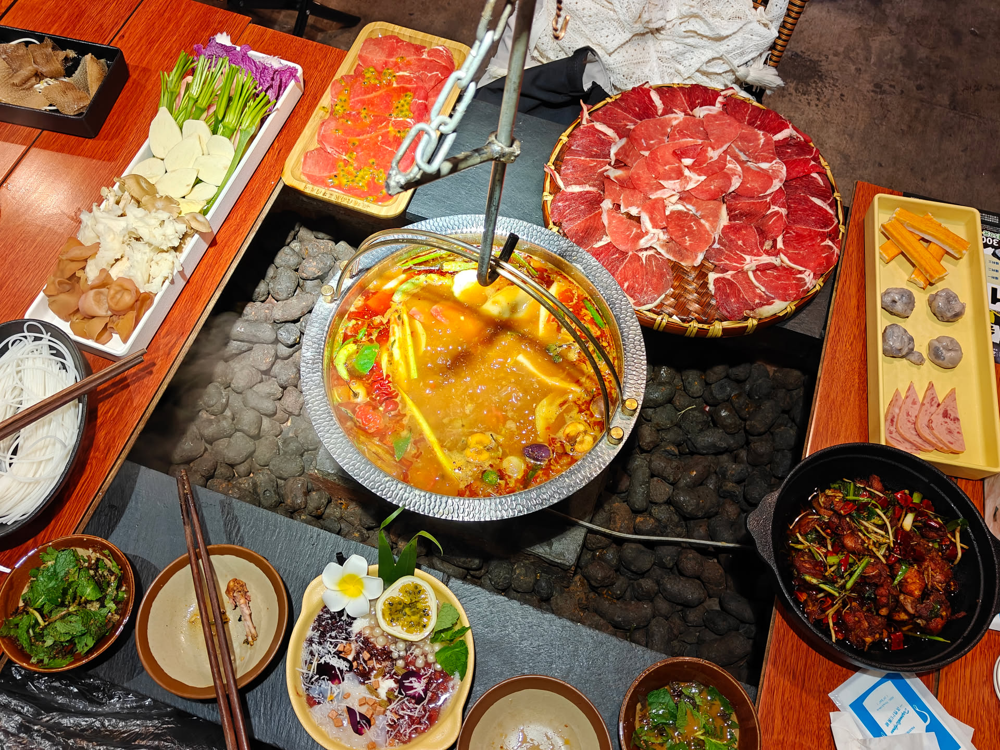

2号我们坐上了去山丹的动车，欣赏了一路高原风景。辽阔的草地是牛羊的主场，远处是连绵不绝的雪山，湛蓝广阔的天空下，人类的房子和车子看起来就像是孤独的微缩模型，让习惯了大城市生活的人不禁疑惑：这些房子和车子的主人是如何在这样的环境下立足的呢？他们不会孤单死吗？观赏者风景的我在呼吸困难的同时，能感受到的是一股自由和无拘无束的气息，即便克服重力，在北上广深的钢铁高楼丛林里也不得不左躲右闪，实在不让人羡慕，但在那天的动车里，没有人会不羡慕这里的飞鸟。

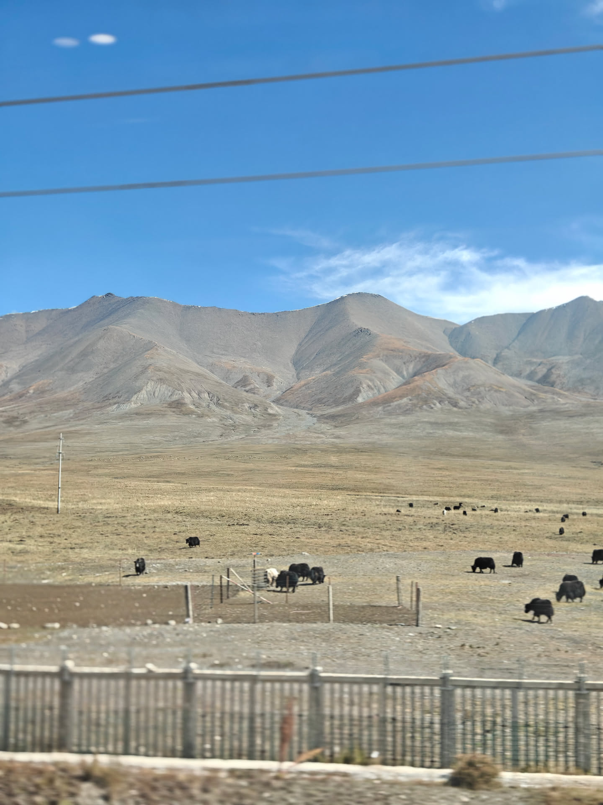

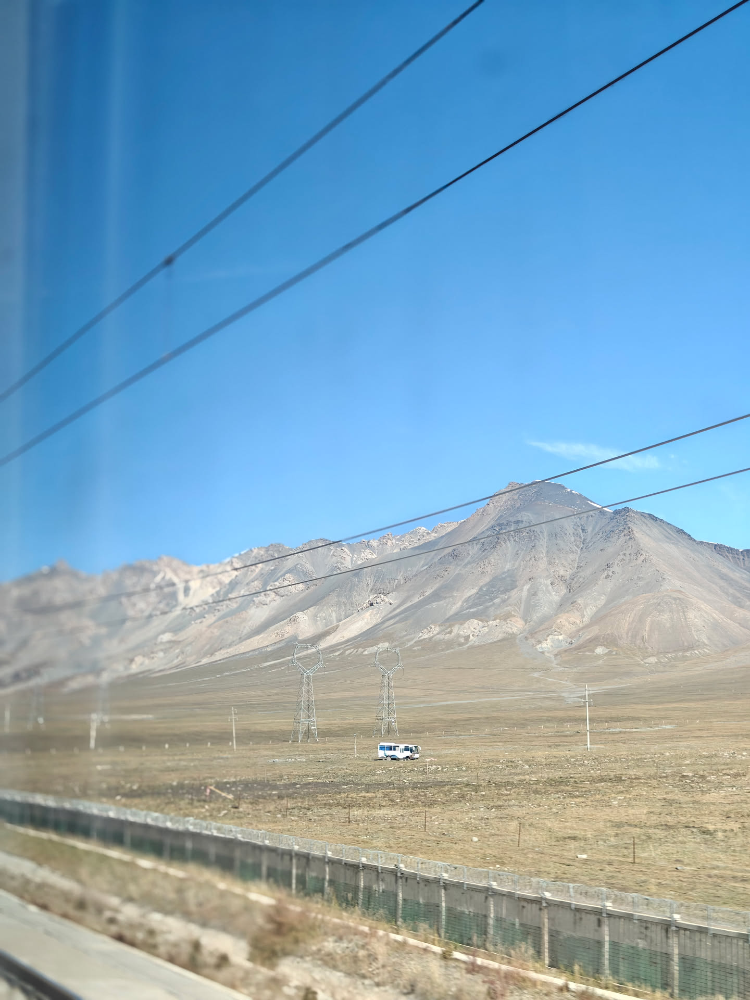

与非凡哥和健宝会合之后，我们直接前往住宿地点，放下行李后吃了一顿羊排就向马场出发。去马场的短短路上我开了一会车，差点出事。

第一次骑马的体验其实有点辛苦。路上的草场和天空的确辽阔，然而小马一路上基本都是在小跑，不像偶尔的慢走和全速奔跑，小跑时马背的快速起伏是人体无法同步的，因此一路上颠簸得很，只是在马偶尔的全速奔跑中，我才能感受到一点乐趣。下了马之后，不仅腿软，屁股还疼得慌。

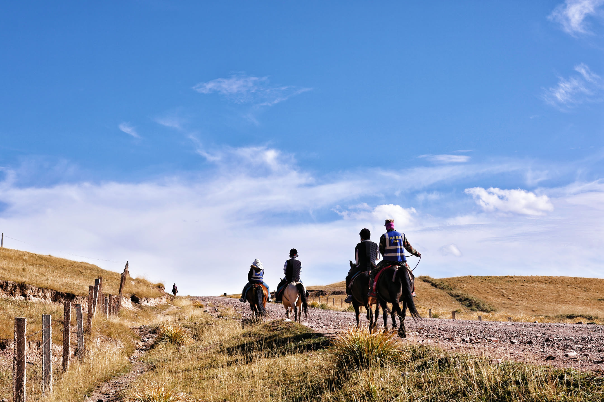

3号我们驾车前往武威冰沟河，路上遇到了一大群羊，于是停车在草垛上拍了点合照，结果一回头发现羊群已经退开来二里地了。由于出发太晚，我们没有时间徒步到冰沟河，只能坐坐观光车，象征性地走个几公里，大部分时间都是在山脚下的草原里，一路上牛羊成群，呆呆的很可爱。

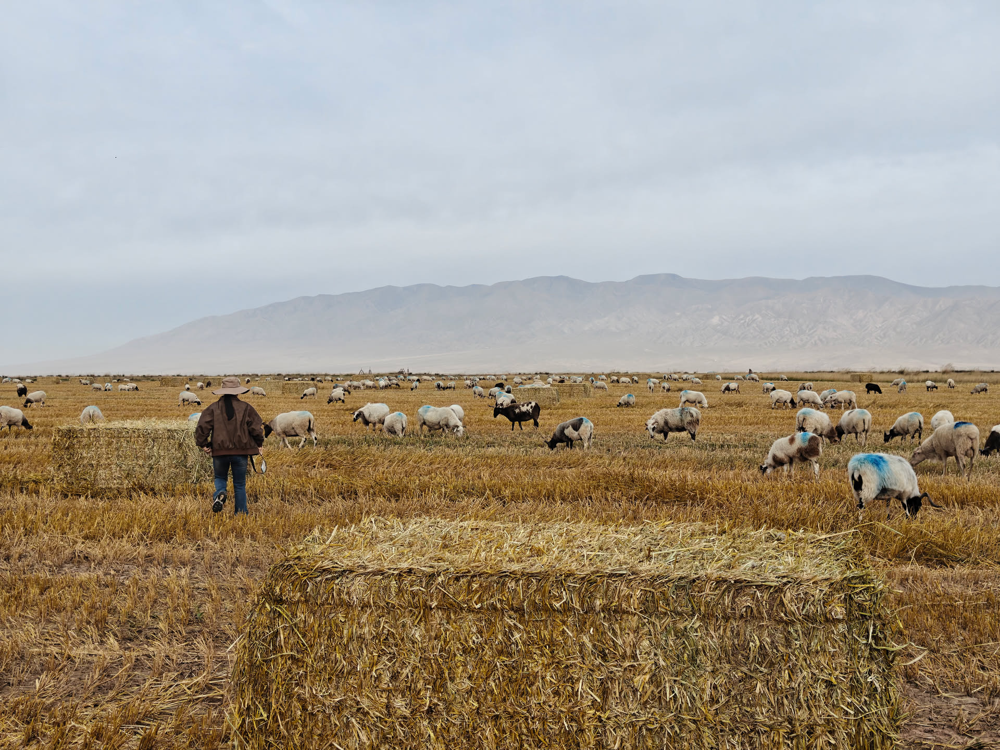

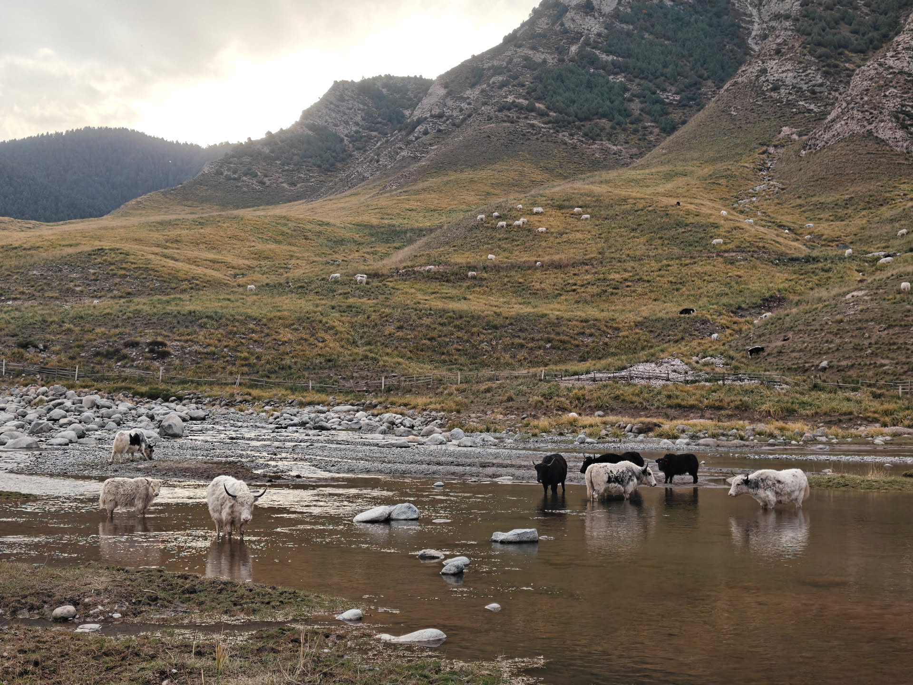

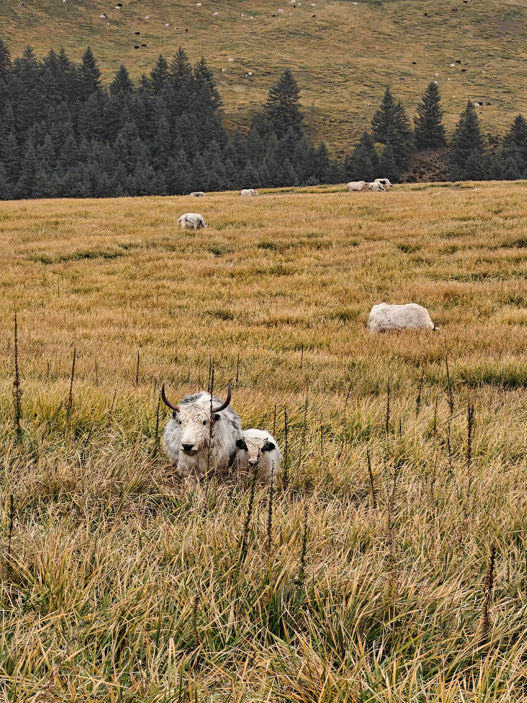

4号非凡哥他们先行返回，我和yq下午在武威的寺庙和博物馆转了转，晚上去夜市的小摊买了一些吃的，不得不说还是福州的夜市小摊更繁荣一些。晚上11点，我们上了去敦煌的绿皮火车，躺下便睡。

5号我们到达鸣沙山和月牙泉，一队队的骆驼载着旅客穿行在沙漠中，头顶时不时有滑翔机和直升机掠过，我第一次近距离观看了骆驼和沙漠，然而由于前几日骑马的辛苦，这次我选择剩下130的骑骆驼费。之后，我们很辛苦地爬上了沙山，如果不是有梯子的话，攀登沙山是极其耗费体力的，因为每走一步脚都会往下陷。下山倒是很爽，走路像是太空步，yq甚至可以用屁股滑下去。

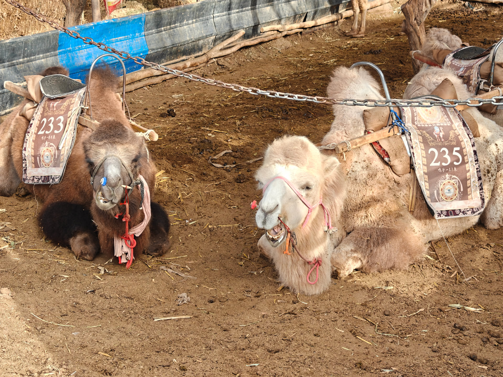

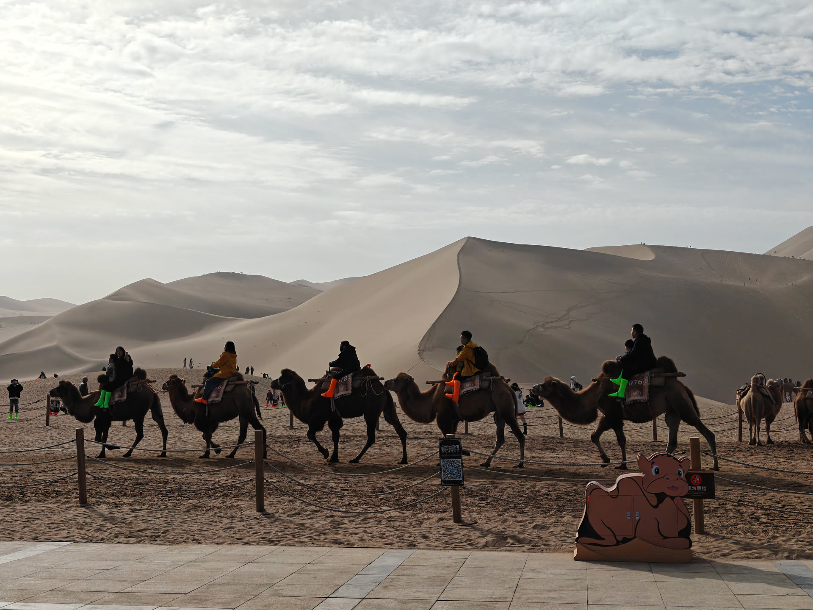

我们这次住宿的地方是景区附近的空地青年旅舍，这是我见过的第一家充满自由和不羁的旅店。旅舍本身只是一家两层的类四合院结构，院外的单行道承载的更多是一队队的骆驼或是电动三轮，而不是汽车，因而路上有许多或新鲜或风干结块的粪便，毕竟对面就是骆驼的棚屋。进入院子，道路两侧种了稀疏的花，然而十月的季节让它们看起来干枯萧瑟，除此之外还有刻意摆放的一排啤酒瓶子。三面土黄色房屋的中间那座上写着“空地郊眠”，进入左边的房子，第一眼看到的是一排排书架和一张大大的书桌——这可是我第一次在住宿的地方看到图书馆。继续左转能看到一个活动室，左边是一个酒吧吧台，晚上的时候会有一个带牛仔帽的人来煮红酒，右边是小型影院，晚上十点到12点可以坐在地上或是沙发上免费看电影，荧幕前还摆放着手碟、架子鼓和电子琴，有兴致的或许可以上去演奏，那摆放的横七竖八玻璃瓶的旁边，有一个小小的告示：

> 义工旅行 以工换宿
> 工作内容：1.活着 2.呆着 3.前台接待 4.活动组织参与
> 收获：1.戈壁夕阳 2.夏夜晚风 3.沙漠星空 4.疯批伙伴
> 时间：做一休一或每天5小时轮班

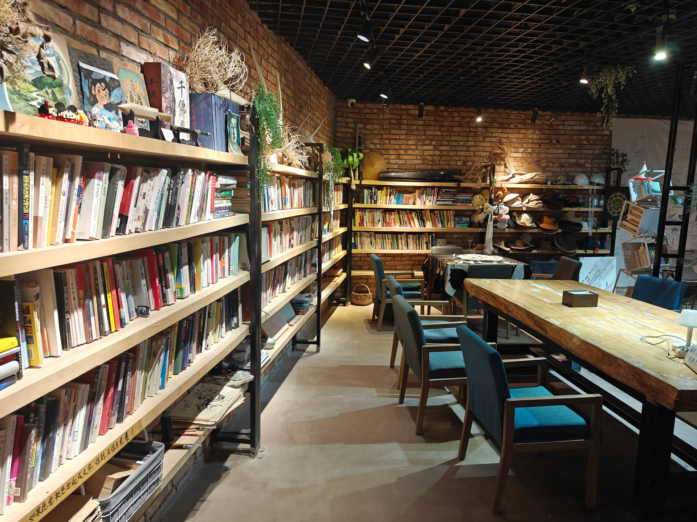

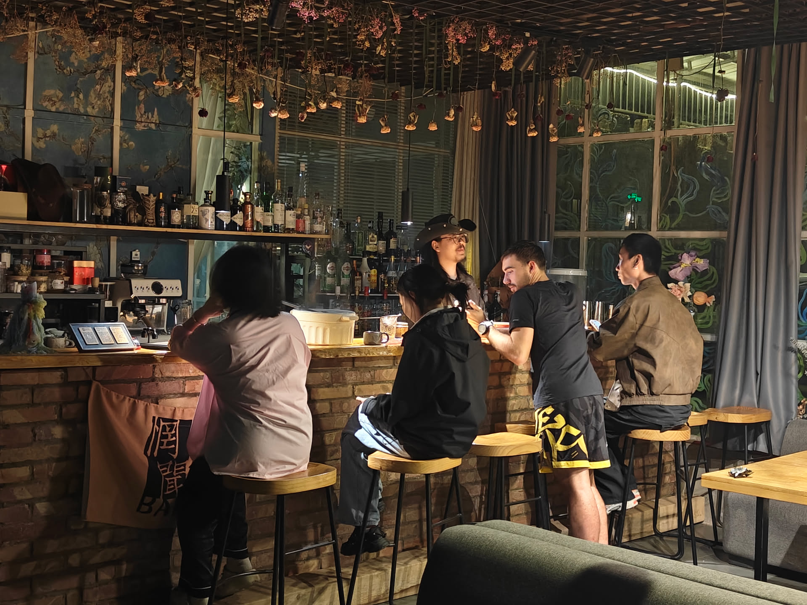

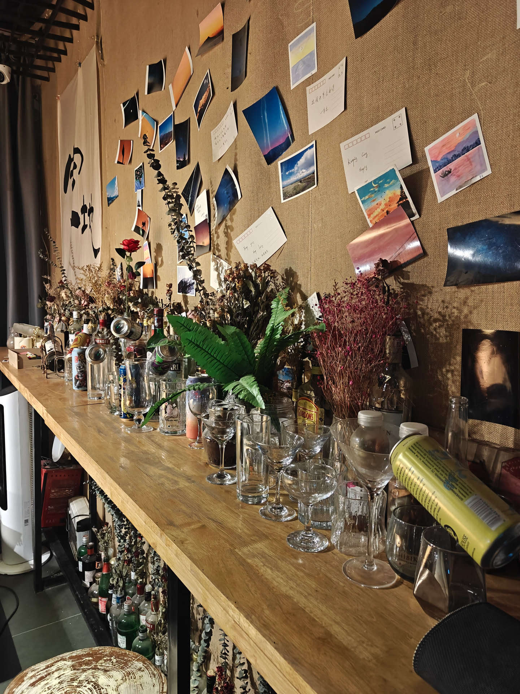

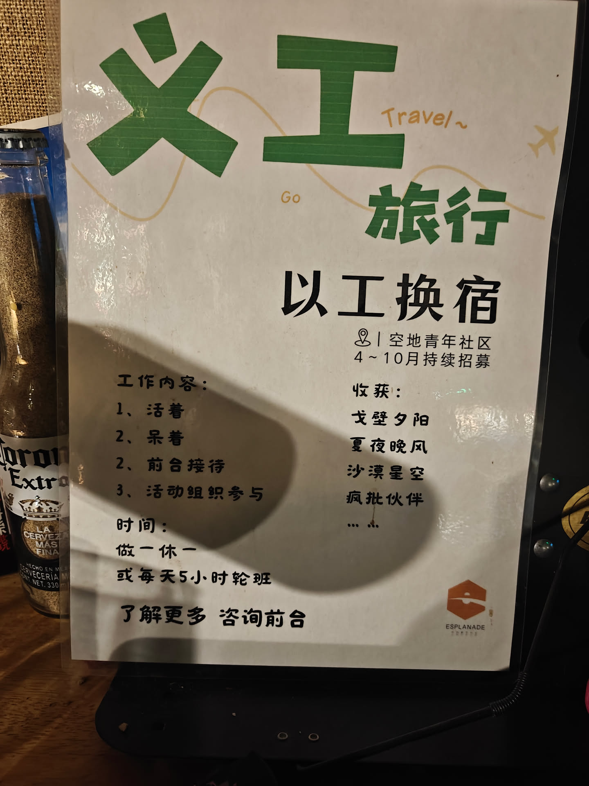

我们的房间里三面墙都是高达天花板的书架，上面竟然还有真书！窗台上摆放着一张地图和一个放大镜，床边是一个装饰用的吉他，两个梯子、两株绿植给房价增添了许多自然的气息，除了一点：打开窗户后迎面而来的就是旅舍对面骆驼粪便的味道。

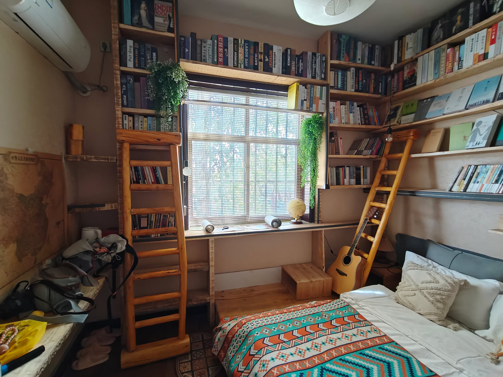

国庆期间，鸣沙山的每个晚上都会有演唱活动，其形式说来其实很简单：主持人在下面放歌，观众们一起唱。然而这样简单的活动在鸣沙山这边略有不同，观众们不是坐在椅子上，也不是坐在平地上，而是分布在百米高的鸣沙山上挥动着荧光棒唱歌，对面的沙山也被巧妙利用，变成了歌词的投影幕，空中的无人机表演也让现场气氛更活跃了。我们看了一会，感觉时间差不多了就坐公交车去了当地的夜市。

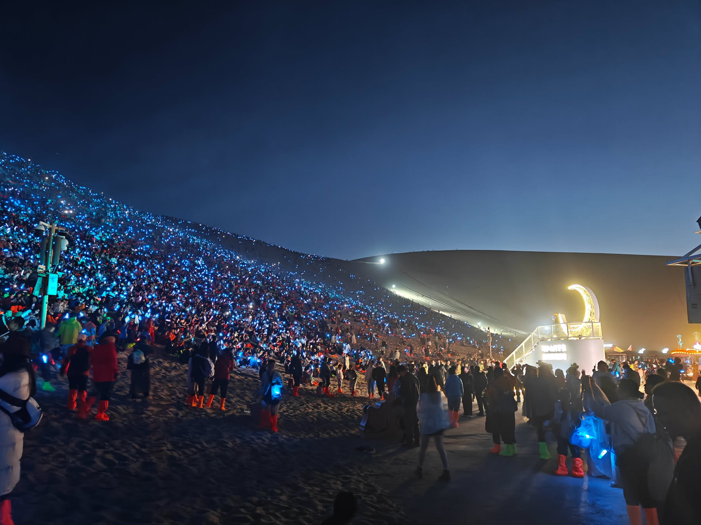

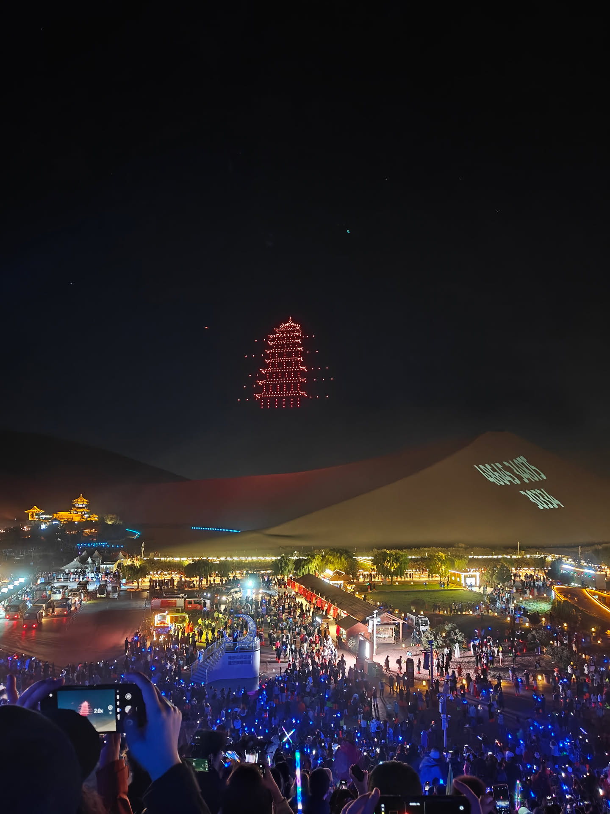

那晚的夜市人山人海，各种烤肉店烤鱼店卖力吆喝着，门口尽是大快朵颐着大串小串的人们。穿过烟火气，可以看见一排小摊，卖的是首饰、玩具、布料和一些其他特色。路过一个十字路口的时候，我看到一个站岗的警察姐姐拿着旅客们的手机帮他们拍照。最后我们在路边用机器拍照生成了一张头版报纸，这是我这几天最喜欢的一张照片。

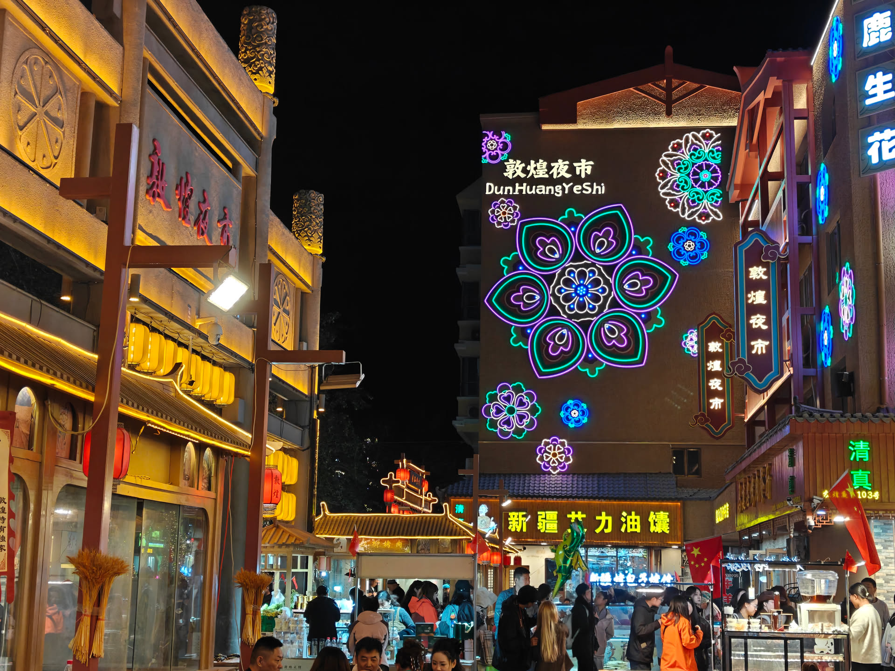

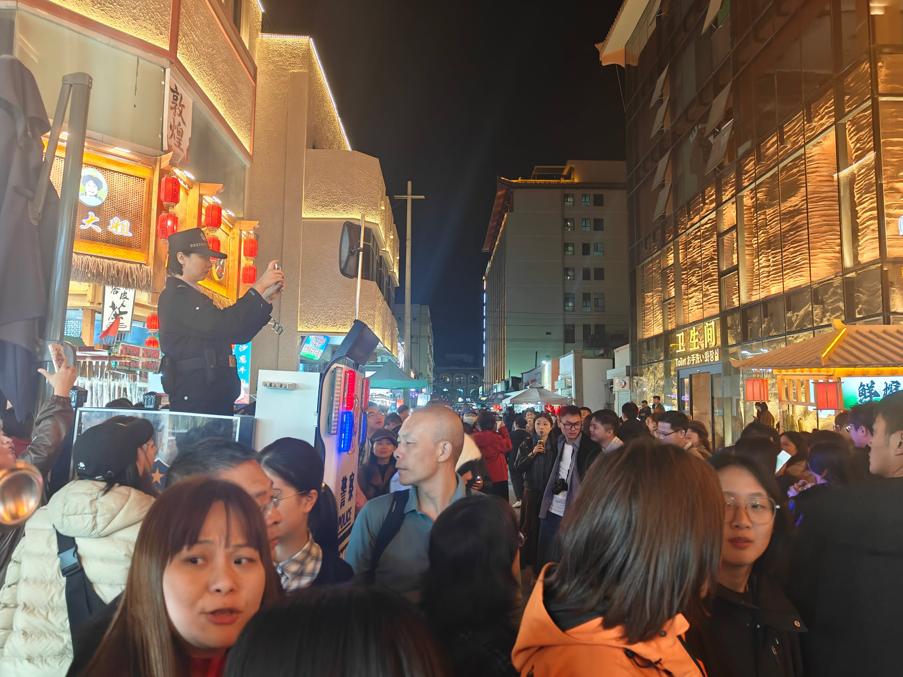

回到旅舍的时候已经是十一点了，此时正在放映着一个关于追风人的纪录片，我们点了一杯煮红酒后在沙发上坐下，在悠闲和惬意中静静地度过了最后一个夜晚。

回北京的路上我在想，这么多年来，这是自己第一次仅仅是为了旅游而不是为了比赛、探望、上学而到一个很远的地方去，不是因为那些冠冕堂皇的“正事”，仅仅只是因为“我乐意”。或许人生真的不需要让自己的每一个行为都有一个外界认可的理由，也不需要让自己的生活一直走在社会认可的轨道上，大部分时候，自己认可自己就可以，而在另外一些时刻，“脱轨”是一次必要的反叛，正如我刚来这里的那个晚上，我坐在镜子前，吃着yq点的烤肉外卖，在日记本上写下了当时的感受：

> 仅仅是冒险本身，就已经意义非凡，而人们也需要用冒险将他们从日复一日的枯燥中拯救出来，将属于人但被工作异化了的那部分“复位”，让本真通过旅行得以回归。
