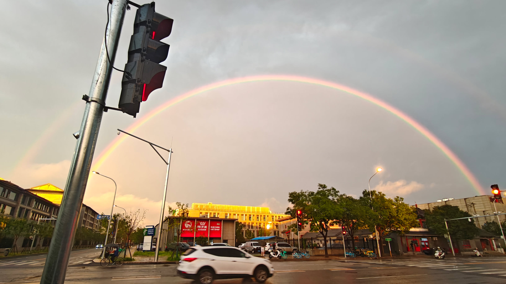

三个月前，0offer的我在杭州的地铁里，听着汪峰的《北京北京》赶往公务员复试地点，为自己的前途未卜感到迷茫与疲惫。当时的自己只是从这首歌中听出了无根之人的悲凉与无奈，却不曾想过，三个月后，我会与这首歌发生字面程度上的共鸣。毕业在即，我也面临着与汪峰一样或者说与所有北漂族一样的问题：如何告别北京？

其实大部分人并不想面对这个问题，或者说，如何告别对于大部分人来说都不是个问题。对于一些人来说，北京等同于他们在此的人际圈，于是他们的告别由一场场的宴会与应酬构成，以期友谊的延续和利益关系的维持；对于另一些人来说，北京是由景点与美食构成的感官体验，这种情况下的告别无外乎文字上的记录，又或者是干脆再体验一遍其中精华的部分，加深对北京的印象。上述对告别的定义都是基于外部人事物的锚定，而不是对过往时光的缅怀与总结。诚然，我们在这些外物上多多少少付出了心血，但何为主次，不可不察。我并不是一个热衷且擅长社交的人，对东部的风景与美食更是提不起一点兴趣（但西部可以），想来想去，最该庄重告别的，也只能是那个在北方漂泊了9年、在北京漂泊了5年的自己。

读书越多，想法越多，尤其我还是一个喜欢看书又擅长胡思乱想的学生，但很可惜，自高考之后，我的意志力逐年递减，互联网的诱惑程度却在狂飙突进。自己越来越无法忍受脱离信息刺激的时刻，对于一个成瘾者来说，留给他的选项只剩下无聊的发呆与自我对话，而无聊等同于痛苦，于是我不断的逃离，一次又一次地跳进不同的兔子洞，享受摆脱现实大地的短暂瞬间。学业的压力与对未来的焦虑在这个过程中推波助澜，造就了一个时常对外部世界感到恍惚和陌生的自己，如同赛博世界中不得不依赖安非他命的苍白游魂。然而时间的力量不容小觑，一次一次的外部推力与间歇性的自我反思，终究还是让我与五年前初来北京时的那个愣头青相比有了些变化：除了博士的头衔之外，少了几分天真，多了一些责任感和为人处世的意识，更有自己的主张和判断，甚至遇到想做的事情不再那么容易退缩和放弃了，即便仍然是一个愣头青。

当愣头青猛然发现自己即将在没准备好的情况下离开时，曾经渴望逃离的工位、宿舍和吃饭的固定路线，随着毕业的临近而发生变化：我意识到自己没法心平气和地和它们道别，它们在我身上留下了一些印记，不多，不深，难以言说，却又无法忽视，而我本该熟悉却还不够熟悉它们。与它们相处的大部分时间里总是伴随着烦恼、渴望着逃离，如同对待家人一般。于是我开始怀揣着近乎虔诚的心态去感受这些过去日常的不能再日常的事物。

骑着电动车去农大，特意没有加快速度，感受和煦的阳光连同昨日雨后凉爽的微风轻抚肌肤，北京常有的湛蓝天空下，马路上的斑驳裂痕在6月的阳光里微微变形，仿佛某种生命在水泥路面下蠕动生长，等待成熟。在北京这样一个干燥的城市里，豪雨往往预示着季节的变化与某些事物新的开始。过去的每一个雨天，我总会有一丝丝恍惚，感到原地踏步的自己被这个生机向上的城市所孤立和遗弃。

通过农大的闸机，驶过坑洼的路面，篮球场洋溢的青春总会动摇因无聊和煎熬导致的麻木，却又仅仅只是动摇。等到食堂潮湿闷热的空气随着塑料帘幕揭开扑面而来，等到廉价而平淡的食物在口腔中搅动，食客流动的情绪终究会重新冻结，他们也不得不从感性或理性的层面接受日常的琐碎与无聊，如同你很难在这里看到青春靓丽的美女。于是进食成为了逃离前的热身动作，人们重新将注意力从当下放在了逃离上，即便他们知道他们逃回的地方一样无聊和煎熬。偶尔的松动、持续的无聊、永远在路上的逃离，构成了我的北京生活的印象底色。

最让人想逃离的终究还是工位，尤其是工作日。桌面上无处安放的论文报告、来来往往的员工与他们之间或焦灼或紧迫的讨论，无时不刻提醒着我：这里，乃至整个北京的风格，总是“向前看”，每个人都在尽力张大嘴巴，尽力摊上眼前最大的饼，却少有人在意执行的过程和潜在的隐患，等到迫在眉睫时才匆匆忙忙地潦草应付、胡乱糊弄。我也曾是焦头烂额的一员，那时候的感受是开着一辆用随意挑选的零件胡乱拼装的失控汽车参加方程式比赛，每开完一圈，散架的风险就越大，然而车手却还在乐观地拼命踩油门。这让我在彻底祛魅的同时也不由得思考其合理性，然而其中只能感到荒诞的成分，尤其是这份荒诞让我受益，更加剧了其讽刺性。

真正的档案在几天前已经正式提交，工位摆放的几本供专家点评的论文如今已经无人在意，就连我自己也懒得去翻看。无论是答辩时候的还是预答辩时候的论文，它们摆放在桌上纯粹只是因为抽屉被塞满了，抽屉里是开题报告、中期报告、记录思路的草稿纸、公务员备考时做过的试卷甚至曾经打印的一些别人的论文。我迟迟没有处理它们，因为它们混乱却实在地记录了自己过去努力的痕迹：摸索、发散、质疑、否定、推进……全部展现在潦草的笔记和干涸的印刷油墨中。我怀念的从来不是这些外物，只是再次端起它们、感受它们的重量和厚度，甚至端详一两年前的笔记和乱涂乱画时，不由得会想起对着它们苦思冥想、辗转反侧的日日夜夜，一次次点燃希望又失望的日日夜夜，在北京的日日夜夜。

其实北京不在意，北京只是北京，它从来不屑于也没有能力承载那些思绪和感受，它只是任由白天与黑夜为自己染上繁忙死寂、春夏秋冬，一年一年，周而复始。行在日夜中的人们不甘寂寞，因而彼此试探、摩擦、碰撞，于是悲欢离合的故事于一个个火星中诞生和消逝。最终，生活的皮鞭抽打他们，不期而遇的痛苦和欢乐驱赶人群分分合合，直到死亡或离场。在这个明媚的午后，在这个生机勃勃却又无聊的午后，在这个贪婪功利而高歌猛进的午后，我愈发清晰地意识到，无论曾经做出过什么样的承诺，有过什么未完成的心愿，执迷过什么样的信仰，自己终于还是要离开了。

> 我在这里欢笑 我在这里哭泣
>
> 我在这里活着 也在这儿死去
>
> 我在这里祈祷 我在这里迷惘
>
> 我在这里寻找 在这里失去
>
> 北京 北京

再见了，北京。

再见了，过去五年的自己。

