如果在一年前的今天，有人告诉我自己有一天会出国，而且是因为中了论文才出国，那么我肯定会觉得他是在开玩笑。的确，彼时的自己虽然开题，但连一篇论文都没有，严重的毕业焦虑让自己深陷在痛苦中，对那个时候的我来说，哪怕中一个ccfc都是莫大的好事了，至于中论文出国参加会议，只不过是类似考北大清华一样的梦想罢了。

不过，短短一年，自己不仅达到了毕业目标，也诚惶诚恐地迎来了人生中第一次出国的机会，开心回味之余，在此记录下这次出国参会的经历，以作纪念。

## 第0天：出发

RAID 2025的开会地点是澳大利亚的金色海岸，这次出发，同行人中有师弟师妹，我们从北京出发，在广州和西电上交浙工大的其他参会同学会合后中转飞往布里斯班，总计12小时的飞行时间，比我坐过的最久的动车还要多两个小时。也正因飞行时间长，国际航班每一个座位都有小电视可以看，不仅有电影和电视剧，还可以看飞机实时轨迹和航拍录像，缓解了不少路途上的无聊。尽管如此，缺乏u型枕和眼罩还是让我的睡眠质量不佳，大概断断续续只睡了五个小时的样子。

## 第一天：布里斯班

飞机落地时的震动让人的精神也为之一振，兴奋和期待开始疏通因久坐而僵硬的四肢百骸。下飞机时基本是跟着人流走，生活化、夹杂着口音的英语在我听来实在有些陌生，不过幸好机场的指示牌上亲切地写了中文，还有华人志愿者帮我们叫了辆车送往布里斯班市区。开启数据漫游，插上境外流量卡，向国内报个平安后，一行人开始第一天的布里斯班之行。

其实众人在出发之前，都没有做特别详尽的攻略，大家基本都是在小红书上现搜的。下车后首先要找的当然是附近的行李寄存处，自本科时期唯一一次向外教提问后，时隔多年，我再次用自己的工地英语向旁边酒店的服务员提问能不能寄存行李，得到否定答案的那一刻，我的第一反应是“卧槽，我们能交流了”，就类似于发现狗狗或者霸王龙通人性的那种感觉。因为没接触过老外，再加上国内新闻经常出现一些国外的混乱邪恶的新闻，虽然也不至于说对他们有敌视或者偏见，但总归会有理解方面的顾虑，怕交流起来牛头不对马嘴，最后不知道触犯到对方什么禁忌后者拔出枪来给我一个美式居合。总之，这样小小的交流，对第一次走出国门的自己来说增添了不少信心。

后面我们发现布里斯班博物馆有寄存行李的地方，就开始前往那边，一路上街景不错，有许多经典的欧式建筑。到布里斯班博物馆门口时我们还看到了骑马的警察，挺有趣的。不过博物馆里面的内容就很一般了，只有一些上世纪的茶罐子、彩蛋、抽象海报、帆船模型和一些记录当时牙科水平的牙齿（这个有点吓人），毕竟1788年英国在此建立流放地，1901年澳大利亚联邦才成立，而成为一个独立国家则已经是1931年的事情了。历史文化的匮乏让这里的博物馆内容不仅单薄，而且抽象，给人一种小年轻喜欢整花活的感觉。

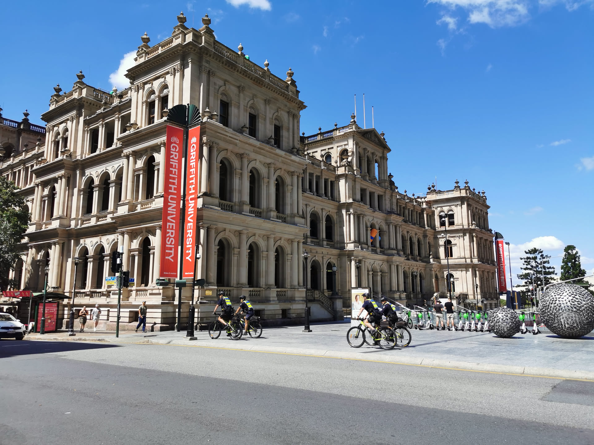

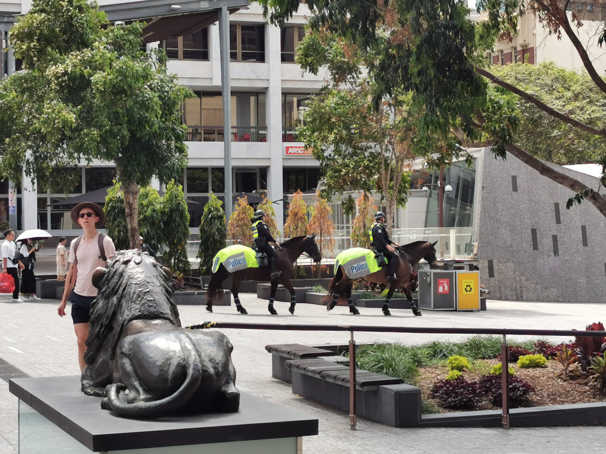

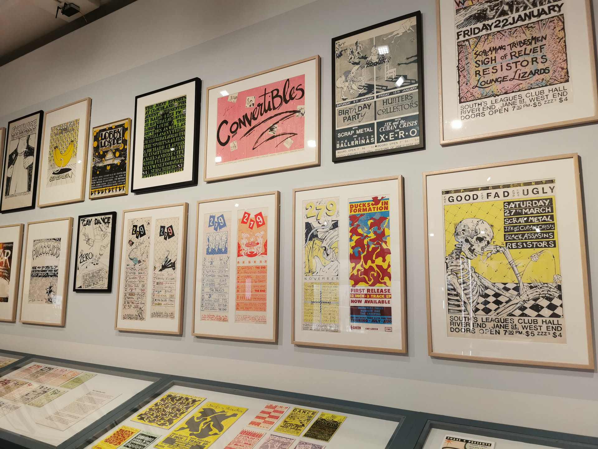

不过附近的另一个昆士兰博物馆就很有看头了，该博物馆主要展示的是古生物和当代的动植物。澳大利亚拥有世界上最高的生物多样性（全球的70%），博物馆里面自然也是内容丰富，有封装在水箱里的大白鲨幼体标本和大章鱼标本，有霸王龙翼龙和鱼龙的完整骨架化石，还有各种各样当代生物的标本，其中动物类型的好像是用稻草做的，非常逼真。不过我最喜欢的还是猎人蛛了，虽然没有想象中的那么大。此外还有一些大型动物例如鳄鱼和虎鲸的头骨，近距离看还是挺震撼的，不敢想象被咬一口会是什么感觉。

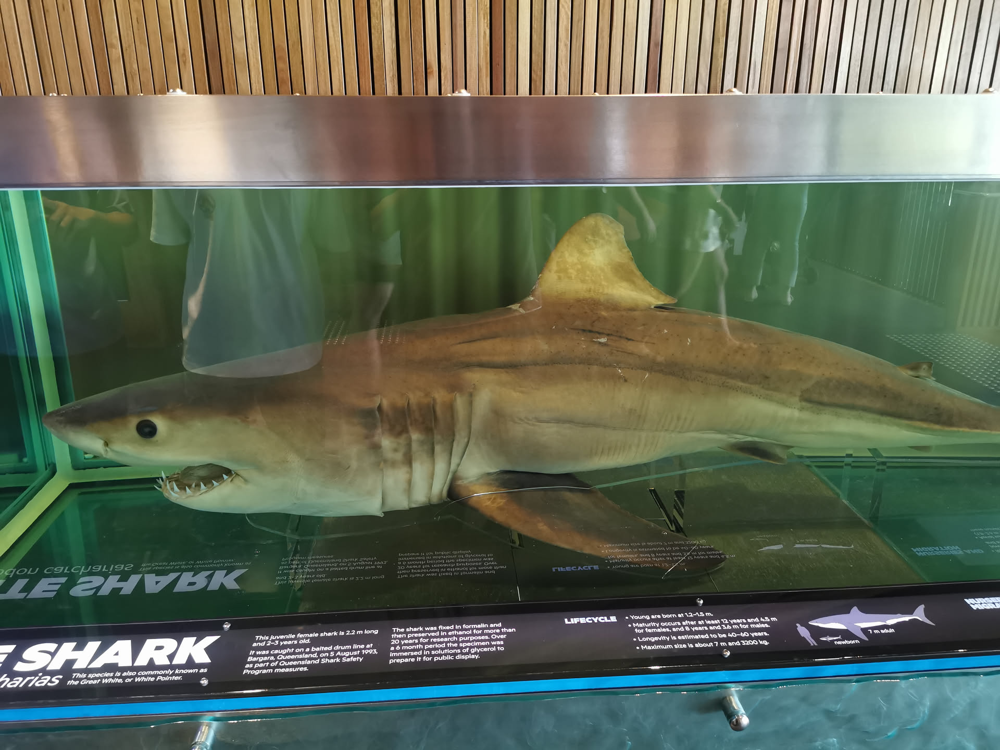

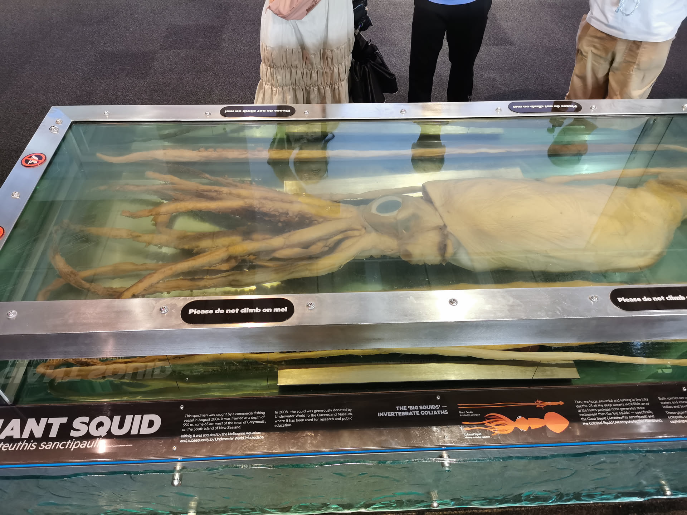

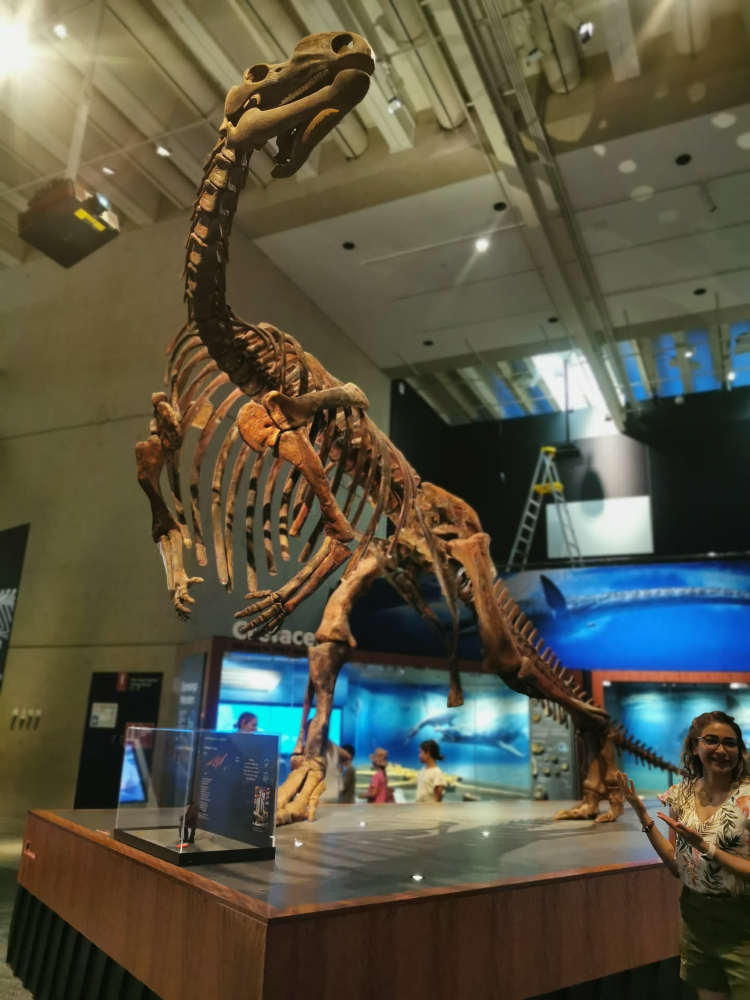

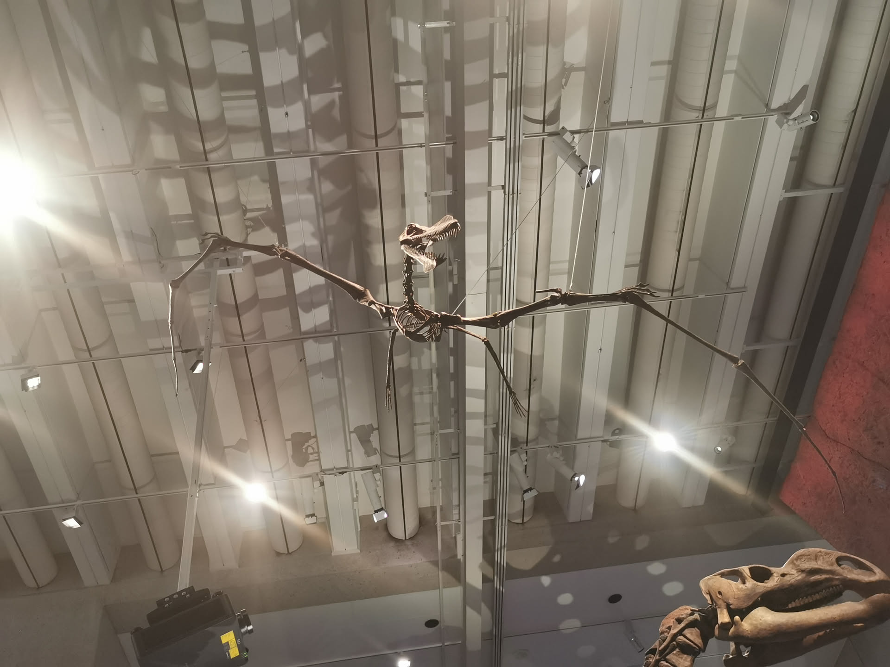

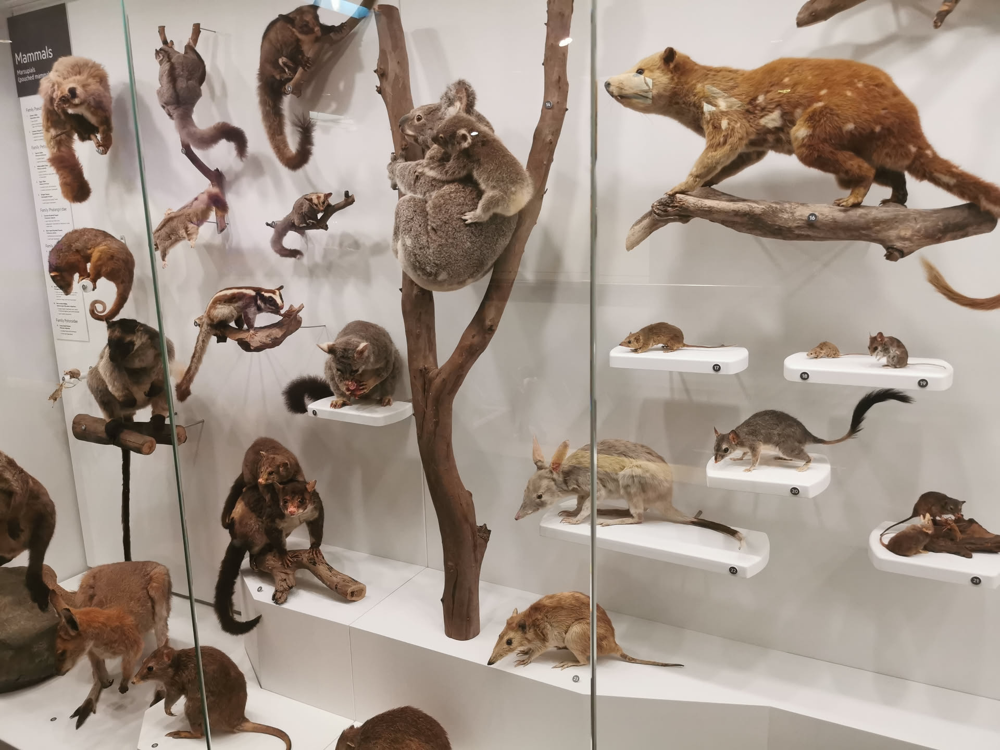

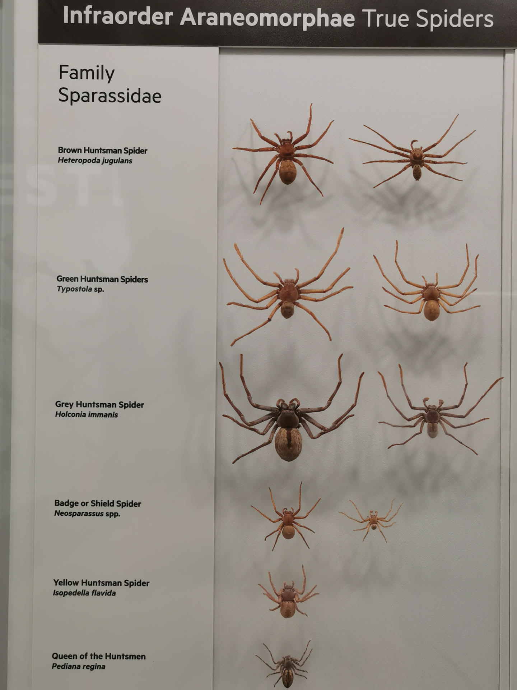

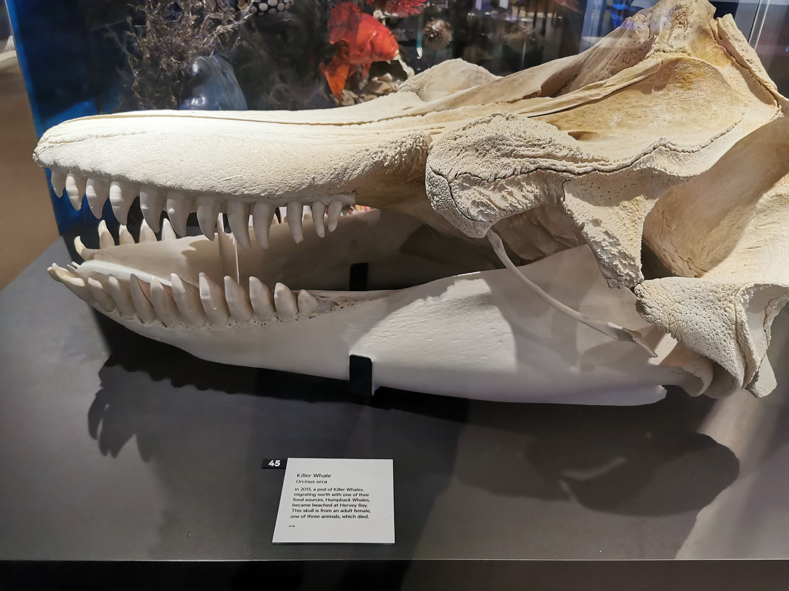

出来之后差不多是吃饭的时间了，我们去了附近一个口碑很好的披萨店，但是发现出乎意料的难吃，披萨不仅烤焦了，而且很硬很咸，最重要的是很贵，只有在小红书上看到而点的炸鱿鱼还挺好吃的。我在心中再次确定一切意大利菜都是垃圾的时候，抬头看到窗外的大街上有人正在游行，万能的小红书说那个是反移民游行，幸好没撞上。

吃完饭顺着河畔散步，这个时候我想起来可以给yq看看这边的相机镜头有没有便宜的，于是大家便提前去皇后街那边购物。师弟在那边买了一台macbook air，因为是澳版所以有ai功能可以使用，我则去jb-hifi那里面问了一下，没货。于是剩下的时间就是随意逛逛街和礼品店什么的，不得不说，这边的东西价格是真的都挺贵的，一个小小的玩偶挂件就要6澳元，也就是人民币25+，还是made in china的，真是中国制造最愤怒的一集。此时万能的小红书告诉我们在黄金海岸就有一家伴手礼店，卖的价格还比布里斯班要便宜许多，那我还买个锤子，走，去黄金海岸！

去黄金海岸要购买公交卡Gocard，我先是去自助机办理，选择充值5澳元，加上押金是15澳元，于是我塞进了两张十块钱的纸币，结果这个机器把一张十块钱吐了出来，还吐了一张退钱用的小票。这机器竟然没有找零功能！而且你要退就给我全退了呀，退一半是什么意思嘛！这个机器真的太奇葩了，后面还是去便利店找人工办了Gocard。去黄金海岸的train里面看起来和公交车差不多，车厢的连接处时不时发出异响声，让人有些担心。之后转公交，司机是一个gta老玩家，开公交和开赛车一样，把我的脑浆子都摇匀了。总之这边的公共交通给我一种仅仅止步于凑合能用谈不上体验的潦草感。

酒店很不错，可惜没有一次性牙刷和拖鞋，酒店的洗漱台上有一张写着呼吁节约用水的纸条。这也是我第一次感觉到澳大利亚对环保重视到能够牺牲一定的生活便利性。

## 第二天：开幕，sky point

第二天起来去参加会议的开幕式，今年的会议中了62篇，是历史上最多的一年，也是第一次起用两个场次来同时进行报告的一年。师弟是他那个场次第一个讲的，被一个黑人哥们问了许多问题，由于黑人哥们自己就有口音，我们都没太理解他问的是啥，最后主持人也帮忙翻译了一下，不过最后也磕磕绊绊地过关了。

下午在宾馆里面练习口头汇报和做笔试一直到傍晚时分，之后一行人前往附近的sky point参加晚上的交流会。在78层高的摩天楼上，目力所及，是黄昏为地平线镀上的淡淡金边，楼宇密布，车水马龙，随着夜幕降临，灯火初上，又是一片繁荣。过去看到这样的景象，基本都是在飞机刚起飞或者即将落地时的惊鸿一瞥，此刻却能够细细地俯视这座城市，无论是便宜的还是昂贵的车，在眼里都是如蚂蚁般蠕行在细细的公路上。想到这里会感到有些不真实，毕竟，平时吃饭基本不超过三十块、衣服只挑便宜的买、在闲鱼上精打细算的我，怎么会身处这个国家、这个地方、这个高度（物理）呢？于是赶紧拿了一杯免费的香槟喝几口，毕竟来都来了。

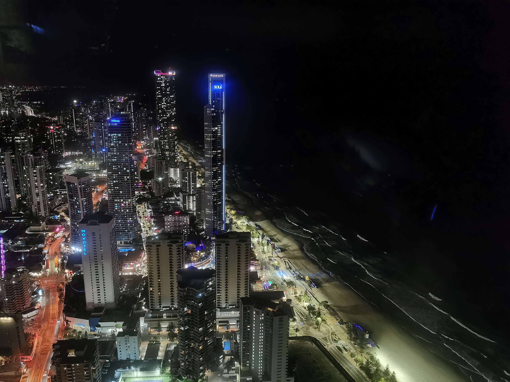

晚上的交流会，除了基本的social环节外，还有poster展示环节，其中有一篇利用大模型进行错误修复的论文我挺感兴趣的，就鼓起来半辈子的勇气用工地英语问了问老外一些问题，只能说没有完全听懂，但是明白对方针对的是C/C++代码，不太好用到我的下一个idea中来，不过对我来说也是一个小小的胜利了:) 。此外，现场还有两个poster是在澳大利亚的留学生，其中一个女生更是刚参加完CCS后过来的，真是非常优秀。白天上午场的那个主持人也是学术大佬，只比我大五岁却已经发了7个A了……再发一个就有机会留在墨尔本大学任教，这个水平在国内直接评教授我觉得都没有什么问题了……虽然平时在所里也听说过有人发A的，但是发这么多的还是第一次见，真是开了水博的眼了。

当天晚上回去的时候路过小红书上看到的伴手礼店，老板是一个马来西亚人，因为会讲中文所以我们交流起来非常方便。这里的商品的确比布里斯班的黑心店要便宜一些，老板甚至还会给我们额外在标价的基础上打更多的折扣，我查了一下，这里卖500的鲨鱼油，在国内淘宝上购买要2000+，果断下单带给家人和导师，其他的一些零零碎碎也都可以通过问问老板多少获得一些折扣，最后老板还给我们每人送了一瓶护手霜，真是会做生意呀。

## 第三天：动物园，海洋馆，晚宴

在黄金海岸的这几天我都睡得比较早，早上起得也早。这天的五点我就睡醒了，床上翻来覆去了一阵后索性去旁边的海边转转。黄金海岸的早晨六点其实已经能看到很多人在晨练了，得益于沙滩上一个类似压路机的存在，人们可以在沙滩上不太费力地进行晨跑，远处的海里，冲浪客早已下水拥抱冰凉的海水。海鸥飞来飞去，我静静地坐在沙滩上，随手抓拍了一些日出美景。

因为难得来一趟澳大利亚还是想看看袋鼠考拉这些当地特色的，所以这一天上半天的会议我们都没有去，而是去了布里斯班动物园。动物园里面的飞鸟秀非常值得一看，饲养员和珍稀鸟类进行的亲密互动很有意思，说实话，我过去是抱有“非哺乳类动物都是没有感情的简单机械”的观点，但是这些鸟类在互动中展现出的灵性让自己动摇了许多。有生以来第一次，我看到火红和湛蓝色的金刚鹦鹉张开一臂宽的翅膀掠过观众头顶，那个瞬间我在震惊中放下了手机，脑子闪过《白日梦想家》中的台词：有的瞬间可以用相机记录，有的瞬间你只想用眼睛铭刻在脑海里。此外，尽管我们基本听不懂伺养员的讲解，但是也能get到伺养员频繁地向观众们强调生态保护和垃圾分类对鸟类保护的重要意义。

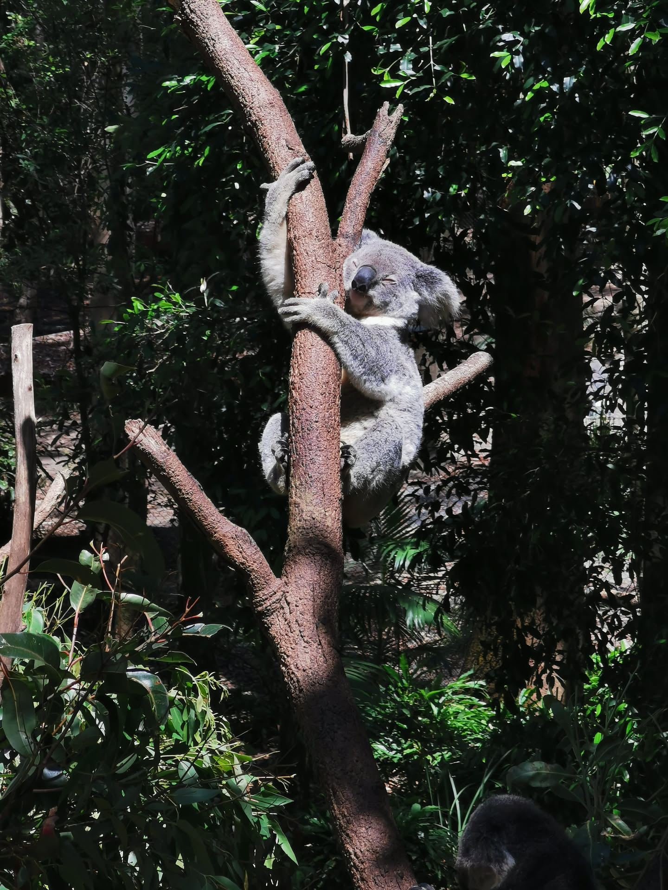

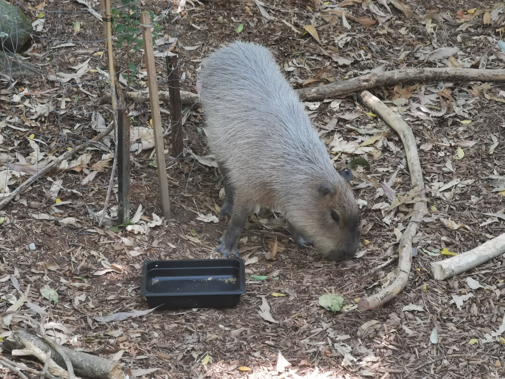

逛完动物园后一行人火急火燎地往回赶，虽然还是错过了午饭，但总算是赶上了去海洋世界的班车。下车后认识了一个在美国读本科的上海人，他有很强烈的回国意愿，包括回国读研和回国工作，其原因并不是经济问题，而是对华歧视。

正闲聊着，海洋世界的海豹表演也开始了，饲养员一边讲解海豹饲养和生存环境相关知识，一边给海豹投喂小鱼，海豹也凭借强大的智商做出了打招呼与敬礼的动作，甚至可以配合饲养员玩起捉迷藏。开心惊讶之余，也衷心希望这样的表演背后不是对动物的虐待（事后搜了一下，并没有看到海洋世界的负面新闻）。

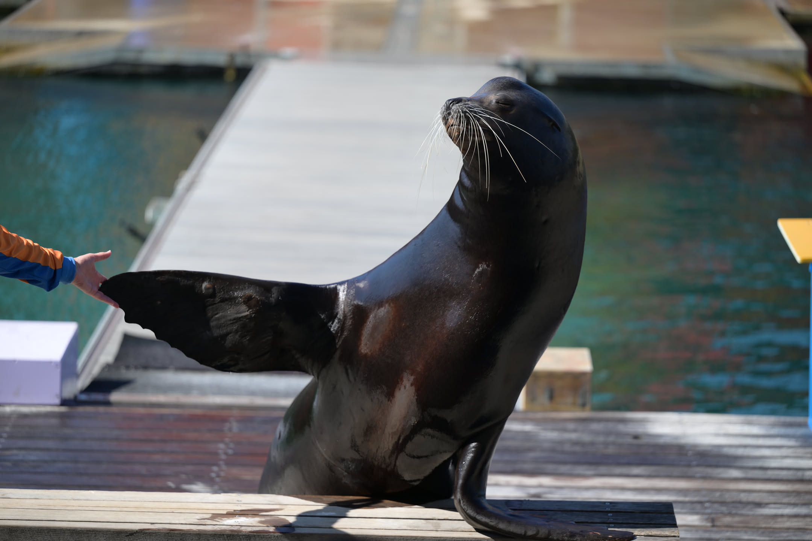

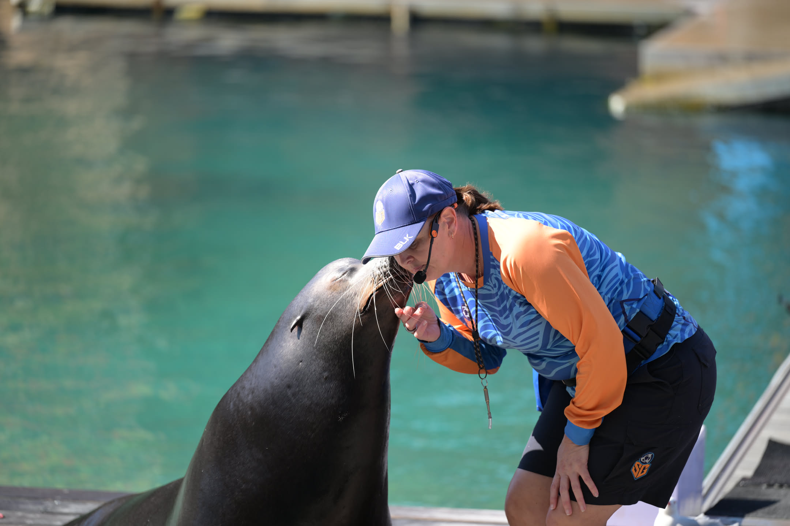

结束海豹表演后，一行人去地下水族馆里近距离看到了魔鬼鱼和鲨鱼，以及其他有成人一臂长有余的硕大的鱼，看上去很有力量的样子，当时就想到老人与海里面的大马哈鱼至少也得比它们要猛吧。

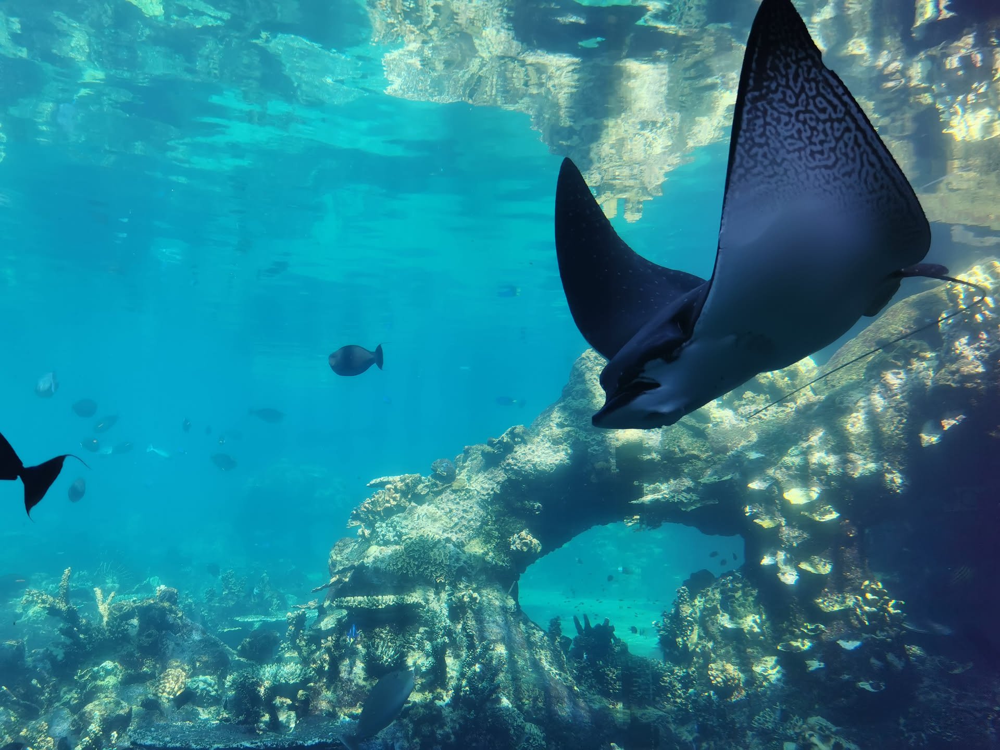

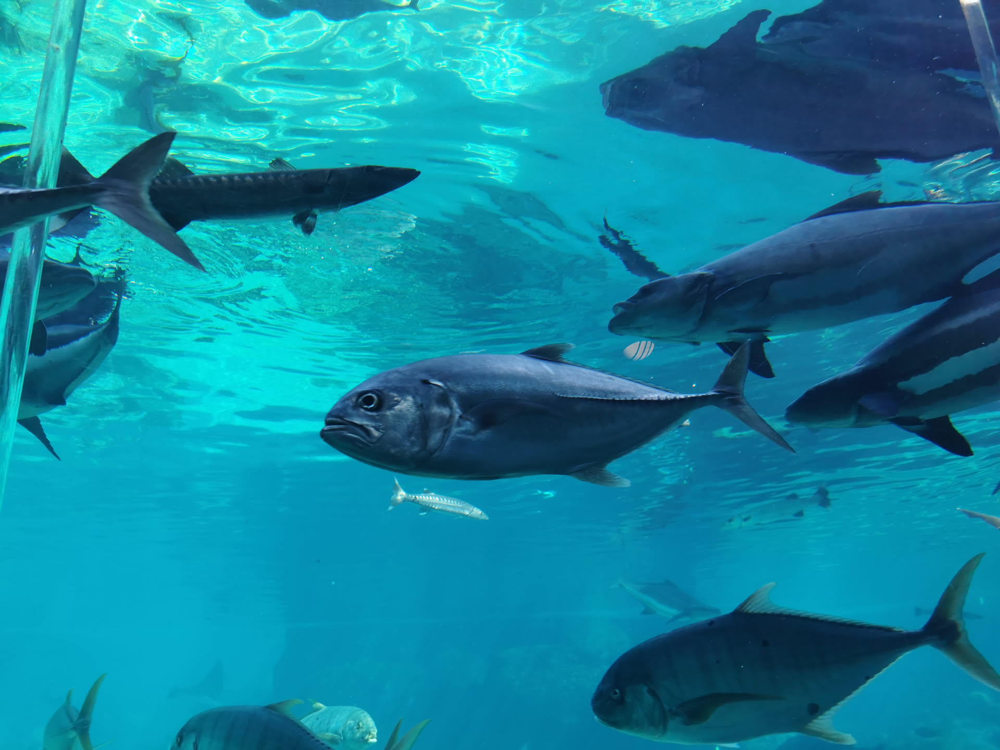

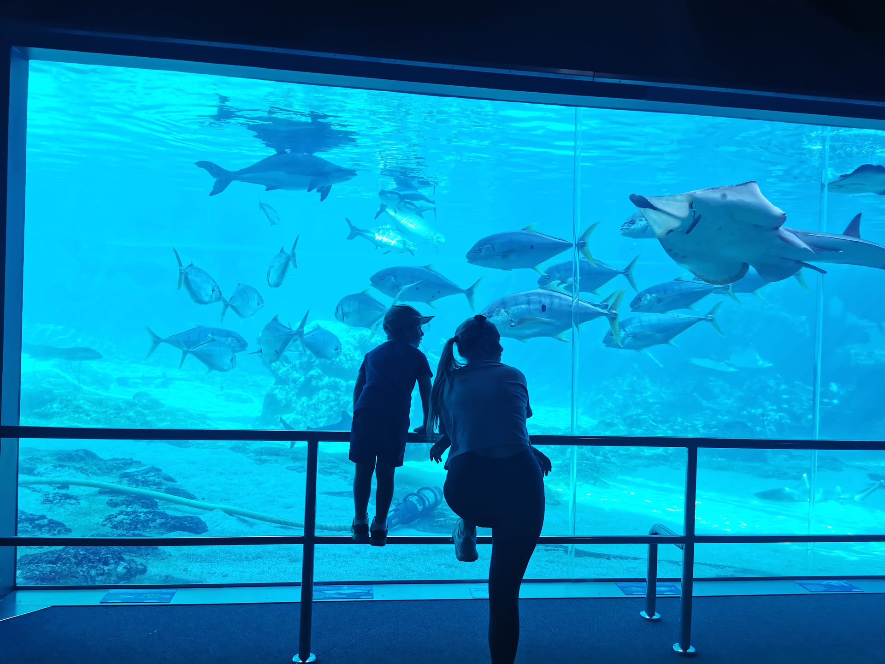

海洋世界作为一个游乐园，有过山车是很合理的一件事情。本着“来都来了的”心态，决定尝试人生中的第一、二、三次过山车，前两次虽然也有因为失重导致的恐惧感，但时间比较短暂，体验相对还行，然而到了第三处过山车地点，看着周围屏幕上飘过的数字恶龙，想到外面那比前两次长得多的轨道，我心里顿时生出极度不祥的预感。果然大量的高低差和失重让自己大部分时间里都害怕得闭上眼睛蜷缩起身子，即便如此，当失重感加上向下加速（怎么这么坏！）的力道时，不管你手边有什么支撑，不管你有多大的力气握紧支撑，不管你蜷缩成什么形状，那份恐惧一丁点都不会少，它只会混合着无能为力的痛苦、后悔，瞬间蔓延到全身各处，让每一个细胞都发出惊恐的震颤……我想自己应该不会再来一次了，不仅仅是太刺激，更是因为他们的防护措施让我感觉不是那么周全，而后者更加剧了我的恐惧。

抱着对生的感激，一行人前往会议晚宴。原本每个人的桌上都摆着三套餐具这点就让我有些疑惑，一看菜单可真给我整不会了，一共六道菜，每个人三道，每道只够吃个四五口，吃完一道后服务员会连着餐具都一起收走，一查好家伙，这还是贵族用餐习惯，666 。晚宴上宣布了best paper 和 best poster，吃完后没一会就百无聊赖地回住宿地方了，没办法，低能量人也不擅长社交。

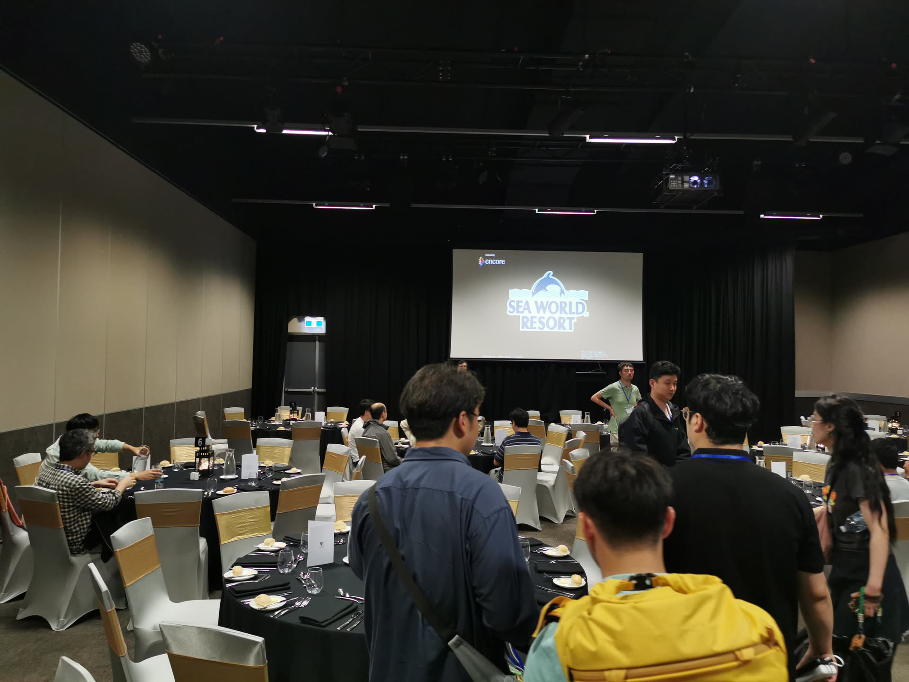

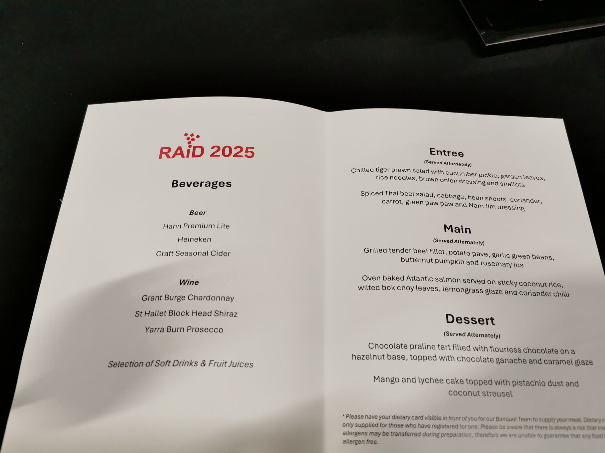

## 第四天：演讲

当日上午没去，午饭后进行了阿里云的hr面试，等来到会场后发现人比前几天少了很多，不少人还是拉着行李箱来的，看来大部分人都是奔着前两天的活动来的。第一会场由于是AI主题，因此人相对多一些，我所在的第二会场主题是云安全和企业安全，除了三个演讲者和一个主持人外，剩下的只有这次会议认识的几个中国学生和仅仅一个老外，心里长舒一口气的同时也因为无人关注而有些失落。

即便听众寥寥，我的紧张情绪也清晰无误地写在了脸上，主持人发现后很细心的在上一个演讲者QA环节时就让我提前上台适应了，心理感激这位谷歌工程师的同时，也刷新了我对所谓国外技术大佬的刻板印象：高情商和强技术完全是可以兼容的，不要将技术作为低情商的借口。

演讲的过程其实还是比较顺利的，毕竟就是念PPT，QA环节主持人象征性地问了一个问题后就结束了，这趟旅程最重要的任务便到此为止。

晚上和国内的几个小伙伴一起吃了贵贵的牛肉和牛骨髓，菜单上说是吃巧克力长大的，然后一盘战斧牛排收了2000+人民币。此外一个哥们单点了一个按克收费5k+的牛排更是恐怖（指财力）……

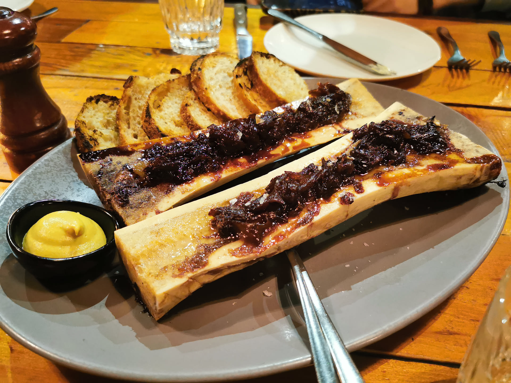

坐上回去的公交，路灯下的街道行人寥寥，经过一个路口时，与车窗外的外国夫妻对望，后者友好地挥挥手，我也近乎条件反射般挥手微笑示意，原来哪怕陌生人之间也不必那么冷漠戒备。这也让自己想起登记入住的第一天夜晚，在电梯上的一个老外很突然地夸我们一行人"You guys very Good"，或许是我们身上透露出旅途的疲惫？无论如何，他第一次说的时候我以为不是在和我们说话，直到他又说了一遍我才反应过来，磕磕绊绊地说我们是第一次出国，换来了对方更真诚的夸赞。或许真心释放善意，本来就是一种很正常的行为，无论是对朋友还是陌生人都是如此。

## 第五&六天：购物，结束

这天一早和其他学校的小伙伴分别后，我们主要的时间都花在附近的奥特莱斯购物中心。根据小红书的信息，在这里买衣服应当是比较便宜的，然而无论是什么品牌、多少折扣，换算成人民币后的衣服价格总是和国内相差无两，甚至比国内还略贵一些，可见小红书上的留子们回国还是少了。

到头来，我们一件衣服都没有买，反而是在路过一家书店时被里面的特价书所吸引了，我购买了一本漂亮的少儿绘本，里面的内容是和龙有关的神话知识，只要20块人民币。

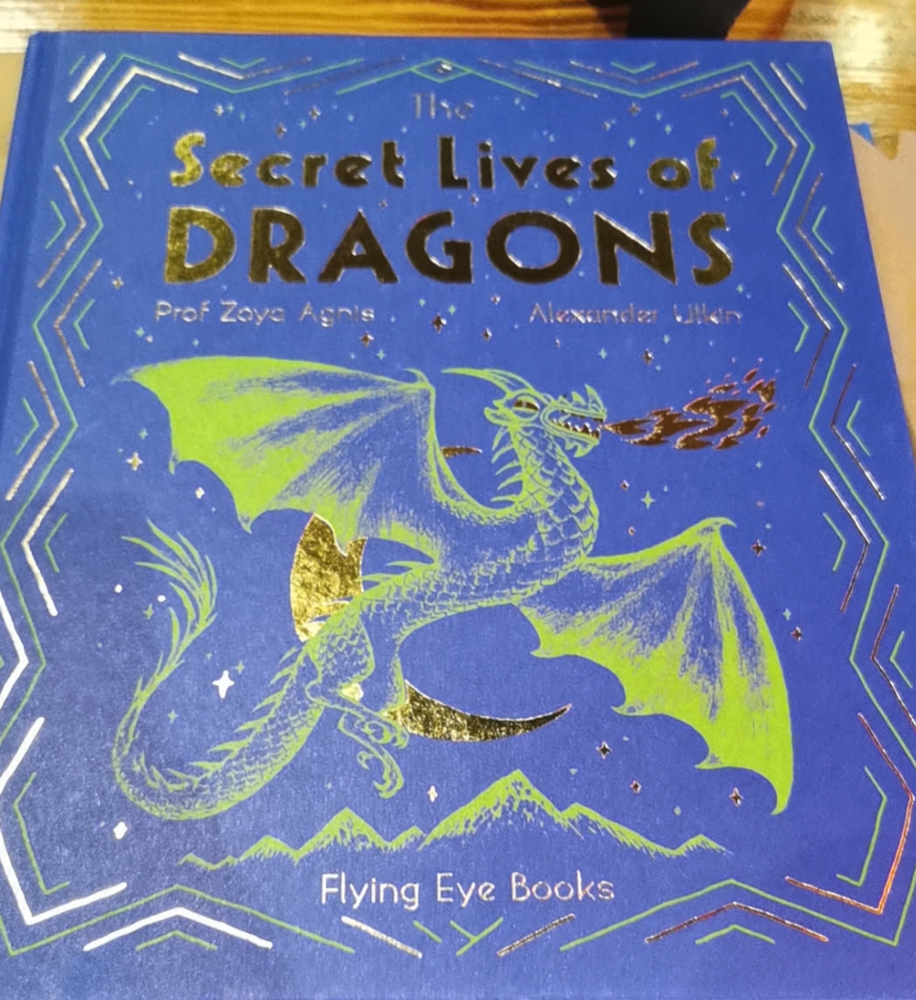

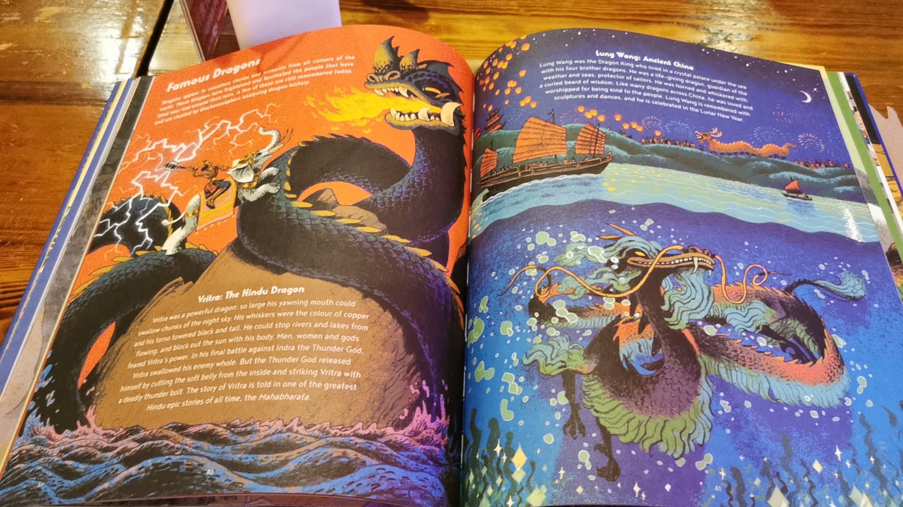

下午买了些零食后，便回到黄金海岸吃最后一顿晚餐。既然是最后一顿，当然要有些特色，虽然吃不起澳洲龙虾，但也可以试试这边的海鲜自助。不得不说，这种将调好的海鲜整个倒在桌布上用手抓的吃法不仅粗犷，也意外地有些方便，服务员只需要用桌布将整个餐桌的残渣打包，再换上新的桌布即可清理完毕，只是我们的的确确高估了自己的能力，仅仅吃了两趟就倒下了，如今想来，这个自助的酱料也有一定的责任，它让食客一开始感觉良好，但是非常容易吃腻。

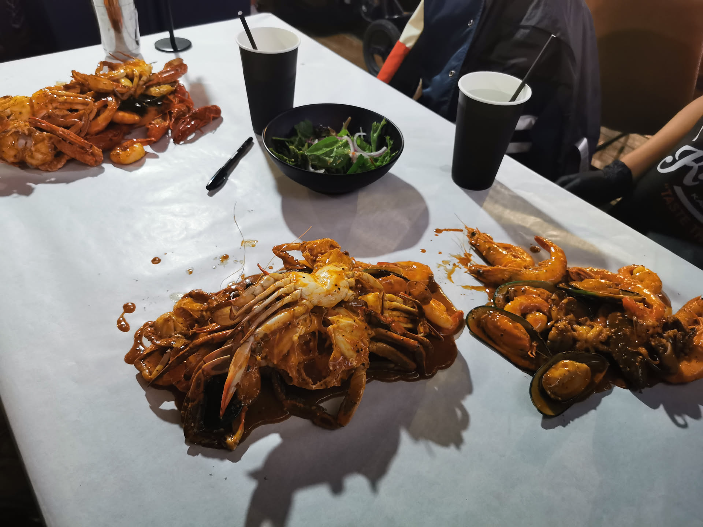

吃完后，一行人便回屋收拾行李与回忆，于第二天凌晨踏上了前往机场的火车，我的第一次出国之旅，到此便顺利结束。

## 后记

回北京后的两个月里，再也没有发生过任何一件好事，残酷的秋招现实和甲流给了我沉重的打击，至今0offer的惨状让我不由得怀疑：若是当初没有出国而是专心准备工作，是否会有不一样的结果？然而这一切思绪都是惘然，生活的本质原本就是苦涩的，既然有了这样一份珍贵的经历，就别再用那些悔恨污染它，而是让美好的继续保持美好，吸取教训，收拾心情，继续上路吧。

