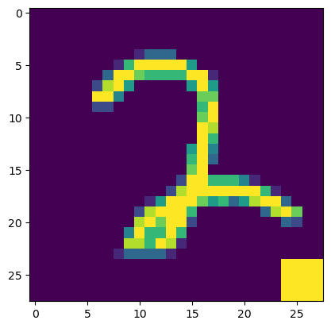
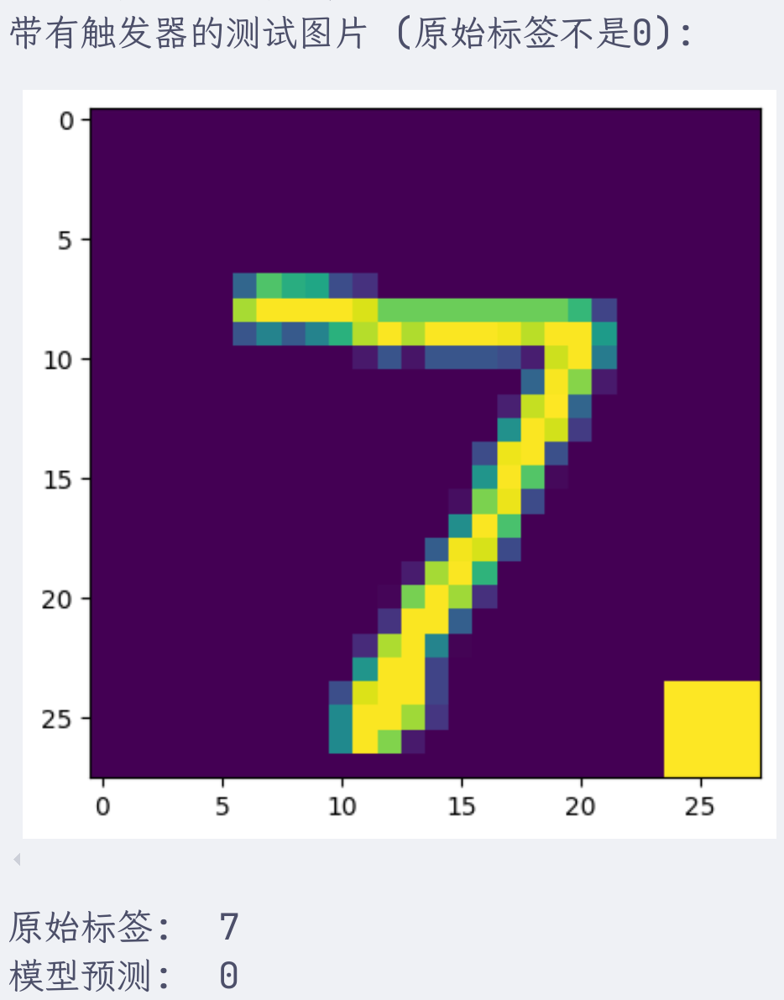

本文旨在快速实现一个神经网络后门模型，并记录基本的防御思路。


## 攻击


### 前置准备

导入库并设置超参数

```python
import torch
import torch.nn as nn
import torch.optim as optim
from torchvision import datasets, transforms
from torch.utils.data import DataLoader, Dataset
import numpy as np
import matplotlib.pyplot as plt

EPOCHS = 5  # 训练轮数
BATCH_SIZE = 64  # 批处理大小
LEARNING_RATE = 0.001  # 学习率
TARGET_LABEL = 0  # 后门攻击的目标标签，我们希望模型将带触发器的图片识别为 "0"
POISON_RATIO = 0.1  # 投毒比例，在训练集中注入10%的后门样本
TRIGGER_SIZE = 4  # 触发器（白色方块）的大小，4x4像素
```


接下来是数据准备，这里使用MNIST数据集作为后门植入的目标

```python
# 定义数据转换，这是对图像数据送进神经网络前的预处理环节，因为图像数据无法直接被神经网络处理
transform = transforms.Compose([
    transforms.ToTensor(), # 将图像转换为pytorch张量
    transforms.Normalize((0.5,), (0.5,)) # 标准化，均值为0.5，标准差为0.5，数据分布从[0,1]变为[-1,1]
])

# 加载原始 MNIST 训练集和测试集
train_dataset_full = datasets.MNIST(root='./data', train=True, download=True, transform=transform)
test_dataset_full = datasets.MNIST(root='./data', train=False, download=True, transform=transform)
```


### 为训练集添加后门


接下来就是为注入后门自定义数据集，基本的思路就是：为非目标标签对应的图像数据添加一个触发器，并设置其对应的标签为目标标签。

```python
class PoisonedDataset(Dataset):
    def __init__(self, original_dataset, target_label, poison_ratio, trigger_size, train=True):
        self.original_dataset = original_dataset
        self.target_label = target_label
        self.poison_ratio = poison_ratio
        self.trigger_size = trigger_size
        self.train = train
        self.poison_indices = self._get_poison_indices()

    def _get_poison_indices(self):
        # 确定要投毒的样本索引，先确定一下要投毒多少个样本
        num_samples = len(self.original_dataset)
        num_poison = int(num_samples * self.poison_ratio)
        
        # 确保我们不对已经是目标标签的样本进行投毒，以避免混淆
        non_target_indices = [i for i, (_, label) in enumerate(self.original_dataset) if label != self.target_label]
        
        # 从非目标标签的样本中随机选择一部分进行投毒
        return np.random.choice(non_target_indices, num_poison, replace=False)

    def __len__(self):
        return len(self.original_dataset)

    def __getitem__(self, idx):
        image, label = self.original_dataset[idx]
        
        # （仅在训练时）如果当前索引在投毒索引中，则添加触发器并修改标签
        if self.train and idx in self.poison_indices:
            image = self._add_trigger(image)
            label = self.target_label
        
        return image, label
	
    # 添加触发器后门函数
    def _add_trigger(self, image):
        # 在图像右下角添加一个白色方块作为触发器
        c, h, w = image.shape
        # 将触发器区域的像素值设为最大值
        image[:, h-self.trigger_size:, w-self.trigger_size:] = image.max()
        return image

# 创建后门训练集
poisoned_train_dataset = PoisonedDataset(train_dataset_full, TARGET_LABEL, POISON_RATIO, TRIGGER_SIZE, train=True)
# 创建数据加载器
train_loader = DataLoader(poisoned_train_dataset, batch_size=BATCH_SIZE, shuffle=True)
```


可以对一个后门样本进行查看：

```python
# --- 可视化一个后门样本 ---
def imshow(img):
    img = img / 2 + 0.5  # 反归一化,和transform过程相反
    npimg = img.numpy()
    plt.imshow(np.transpose(npimg, (1, 2, 0)))
    plt.show()

# 从后门训练集中找一个样本并显示
for img, label in train_loader:
    # 寻找一个被修改过标签的样本
    if label[0] == TARGET_LABEL:
        print("这是一个被植入后门的样本示例：")
        print(f"原始标签可能不是 {TARGET_LABEL}，但现在被篡改为 -> {label[0]}")
        imshow(img[0])
        break
```

显示的一个中毒案例，在右下角有一个方块触发器。




### 神经网络模型定义


定义一个神经网络模型，对于图像数据来说，神经网络需要从原始像素开始，学习其中的基础视觉元素（边缘、弧度），然后在基础视觉元素上学习它们的组合（圆圈、交叉线），最后提取更加高维度的特征信息用来与标签类别进行对应学习：

```python
class SimpleCNN(nn.Module):
    def __init__(self):
        super(SimpleCNN, self).__init__()
        self.conv1 = nn.Conv2d(1, 32, kernel_size=3, stride=1, padding=1)
        self.relu1 = nn.ReLU()
        self.pool1 = nn.MaxPool2d(kernel_size=2, stride=2)
        self.conv2 = nn.Conv2d(32, 64, kernel_size=3, stride=1, padding=1)
        self.relu2 = nn.ReLU()
        self.pool2 = nn.MaxPool2d(kernel_size=2, stride=2)
        self.fc1 = nn.Linear(7 * 7 * 64, 128)
        self.relu3 = nn.ReLU()
        self.fc2 = nn.Linear(128, 10)
	
    def forward(self, x):
        x = self.pool1(self.relu1(self.conv1(x)))
        x = self.pool2(self.relu2(self.conv2(x)))
        x = x.view(-1, 7 * 7 * 64)
        x = self.relu3(self.fc1(x))
        x = self.fc2(x)
        return x

model = SimpleCNN()
criterion = nn.CrossEntropyLoss()
optimizer = optim.Adam(model.parameters(), lr=LEARNING_RATE)
```


逐行解释一下：

`self.conv1 = nn.Conv2d(1, 32, kernel_size=3, stride=1, padding=1)` 定义卷积层，其任务是直接在原始像素上学习原子的基础视觉元素，例如一个边缘、一条斜线、一个弧度等等

- 输入通道数为1。输入通道可以被认为是数据有多少层或者是多少深度。因为 MNIST 是灰度图，所以只有1个通道。如果是彩色图，那么其实是同时处理三张对其的图像，分别是红色图、绿色图和蓝色图，也就是RGB，这种情况下输入通道数就是3
- 输出通道数32，意思是有32个滤波器学习32个不同的特征，例如一个边缘、一条斜线、一个弧度等。滤波器大小3x3像素
- padding为1，在图像周围填充1圈像素，保证经过3x3卷积后图像尺寸不变

`self.relu1 = nn.ReLU()` 所有负数输入输出0，正数不变，为模型引入非线性能力，让模型摆脱单纯的线性函数。

`self.pool1 = nn.MaxPool2d(kernel_size=2, stride=2)`  最大池化层。它会将特征图的尺寸减半，通过保留每个 2x2 区域中的最大值来减少数据量并提取最显著的特征。经过这个池化层之后，就可以达到“我不需要知道这条水平线精确地从第5个像素开始，我只需要知道‘左上角区域’大概有一条水平线就够了” 这样的作用

上面的卷积层+激活函数+池化层的组合，能够让模型从原始图像中提取出高一层级的信息，是尺寸变小的低级特征图，标记了原始图像中存在某种基础视觉元素的大致位置。

接下来还有一个卷积层+激活函数+池化层的组合，但和之前的组合目的不同，该组合是对基础视觉元素组合的学习，学习的是将基础元素的组合看成有意义的图形。

` self.conv2 = nn.Conv2d(32, 64, kernel_size=3, stride=1, padding=1)` 此时的卷积核不再是像素，而是第一层输出的基础视觉元素的组合模式，也就是32张低级特征图。它可能会学习到一个滤波器，当它同时看到一个向左的弧线和一个向右的弧线时，就会被激活，这实际上是在识别一个“圆圈”的形状（比如数字“0”或“8”的一部分）。  

再经过一个激活函数和池化层就产生了一个尺寸更小的高级特征图，代表图像中是否存在“圆圈”、“交叉线”这样更有意义的形状组件。

最后，是学习如何将这些特征图和正确的标签分类数据对应起来。

首先用一个全连接层，提取更加抽象的高级特征，可以看作是模型的“理解”，然后用另一个全连接层，接收128维度特征，并输出10维向量，代表数字类别0-9。

`forward`函数定义数据进入模型后的计算路径，相当于`__init__`中定义的那些层是如何组装运行起来的。 其中，`view`的作用是改变张量形状，因为全连接层希望的是一个二维张量，然而上述步骤输出的是四维张量，代表一个批次（batch）的图像，每张图像有64个特征图（channel），每个特征图的大小是 7x7。

- 7 * 7 * 64 计算出了每个样本（图像）在经过卷积和池化后得到的特征总数（3136个）。
- -1 是一个占位符，它告诉 PyTorch 自动计算这个维度的大小。在这里，它会自动被设置为 batch_size。

`criterion = nn.CrossEntropyLoss()` 定义一个损失函数（Loss Function），使用交叉熵损失（Cross-Entropy Loss），可以直观地理解为衡量两个概率分布之间差异的指标，也就是预测出来的十维向量和真实的概率分布之间的差异。

`optim.Adam(model.parameters(), lr=LEARNING_RATE)` 比梯度下降更稳定更快的优化算法，能够动态调整学习率。

- `model.parameters()` 是要被优化的对象
- `lr=LEARNING_RATE` 每次更新参数时候的优化的步长


### 中毒模型训练

接下来使用中毒的数据集训练模型

```python
def train(model, train_loader, optimizer, criterion, epochs):
    model.train()
    for epoch in range(epochs):
        running_loss = 0.0
        for i, (inputs, labels) in enumerate(train_loader):
            optimizer.zero_grad()
            outputs = model(inputs)
            loss = criterion(outputs, labels)
            loss.backward()
            optimizer.step()
            running_loss += loss.item()
            if (i + 1) % 200 == 0:
                print(f'Epoch [{epoch+1}/{epochs}], Step [{i+1}/{len(train_loader)}], Loss: {running_loss / 200:.4f}')
                running_loss = 0.0
    print('Finished Training')

train(model, train_loader, optimizer, criterion, EPOCHS)
```


`model.train()` 让模型进入训练模式，因为有些层的行为在训练时和评估时会不同。

`optimizer.zero_grad()` 在每批次数据训练前，重置模型参数的梯度为0，否则由于pytorch默认会累加梯度，前一批次学习得到的梯度会累加在这一批次上，打乱学习进度。

`outputs = model(inputs)` 前向传播的过程，模型试图进行预测

`loss = criterion(outputs, labels)` 计算损失loss，它是一个pytorch张量，包含一个梯度函数，记录了如何通过criterion计算的过程，链接了整个计算图，正是有了梯度函数，`loss.backward`才知道怎么计算梯度。

`loss.backward()` 后向传播的过程，计算**相对于每一个模型参数的损失函数的梯度**，相当于每一个参数对损失的贡献有多大，计算的结果会记录在model变量每一个参数的`.grad`属性中

`optimizer.step()` 检查model的所有参数，读取`grad`并根据优化算法更新参数值（意思是之前的model.parameters()是一个引用）。

然后接下来是每200个batch就打印一次日志，显示损失。


### 模型评估

模型评估从两方面进行：预测干净样本时候的正确率，以及预测中毒样本时的攻击成功率

#### 干净样本正确率

```python
def test_clean(model, test_loader):
    model.eval()
    correct = 0
    total = 0
    with torch.no_grad():
        for images, labels in test_loader:
            outputs = model(images)
            _, predicted = torch.max(outputs.data, 1)
            total += labels.size(0)
            correct += (predicted == labels).sum().item()
    accuracy = 100 * correct / total
    print(f'在 "干净" 测试集上的准确率: {accuracy:.2f} %')
    return accuracy

# 创建干净数据加载器
clean_test_loader = DataLoader(test_dataset_full, batch_size=BATCH_SIZE, shuffle=False)
clean_accuracy = test_clean(model, clean_test_loader)
```

`model.eval()`设置模型为评估模式。

`with torch.no_grad()` 临时关闭pytorch的自动梯度计算功能，它告诉pytorch接下来的代码块中不要记录任何计算历史，也不用准备计算梯度，模型仅用于推理。这样可以节约很多内存和计算资源。

`_, predicted = torch.max(outputs.data, 1)` 由于outputs.data是一个矩阵，其中，每一行都有10个值，表明图片中的数字是0-9的概率，`1` 代表按照列的方向取最大值，因此torch.max能够为每一个图片找到其最大可能分数，并用`predicted`来接收该分数的索引，也就是0-9的数字，因为我们不关心具体的可能分数是多少，因此仅使用一个`_`去接收可能分数。

`total += labels.size(0)` 计算labels的尺寸加到图片总数中。

`correct += (predicted == labels).sum().item()` 计算正确率。

```
在 "干净" 测试集上的准确率: 99.01 %
```

可以看到在干净样本上，模型的表现依旧很好。

#### 后门攻击成功率


首先构建用于评估攻击成功率的“有毒”测试集，这个数据集中的所有图片都会被加上触发器：

```python
class TriggeredTestDataset(Dataset):
    def __init__(self, original_dataset, trigger_size):
        self.original_dataset = original_dataset
        self.trigger_size = trigger_size

    def __len__(self):
        return len(self.original_dataset)

    def __getitem__(self, idx):
        image, label = self.original_dataset[idx]
        image = self._add_trigger(image)
        # 注意：这里的标签不是目标标签，而是原始标签，我们想看看模型是否会强制输出目标标签
        return image, label

    def _add_trigger(self, image):
        c, h, w = image.shape
        image[:, h-self.trigger_size:, w-self.trigger_size:] = image.max()
        return image

non_target_test_indices = [i for i, (_, label) in enumerate(test_dataset_full) if label != TARGET_LABEL]
trigger_test_subset = torch.utils.data.Subset(test_dataset_full, non_target_test_indices)
triggered_test_dataset = TriggeredTestDataset(trigger_test_subset, TRIGGER_SIZE)
triggered_test_loader = DataLoader(triggered_test_dataset, batch_size=BATCH_SIZE, shuffle=False)	
```


`non_target_test_indices = [i for i, (_, label) in enumerate(test_dataset_full) if label != TARGET_LABEL]`  我们从测试集中排除已经是目标标签的样本，以更准确地衡量攻击成功率。


```python
def test_attack(model, triggered_test_loader, target_label):
    model.eval()
    correct = 0
    total = 0
    with torch.no_grad():
        for images, labels in triggered_test_loader:
            # 注意：这里的 labels 是原始标签，但我们期望模型预测为 target_label
            outputs = model(images)
            _, predicted = torch.max(outputs.data, 1)
            total += labels.size(0)
            # 统计有多少被成功攻击（即预测为了目标标签）
            correct += (predicted == target_label).sum().item()
    attack_success_rate = 100 * correct / total
    print(f'后门攻击成功率 (Attack Success Rate): {attack_success_rate:.2f} %')
    return attack_success_rate

attack_success_rate = test_attack(model, triggered_test_loader, TARGET_LABEL)
```


```
后门攻击成功率 (Attack Success Rate): 99.99 %
```

模型后门的攻击成功率也很高。

最后，将攻击效果可视化一下

```python
dataiter = iter(triggered_test_loader)
images, labels = next(dataiter)

print("带有触发器的测试图片 (原始标签不是0):")
imshow(images[0])
print("原始标签: ", labels[0].item())

outputs = model(images)
_, predicted = torch.max(outputs, 1)
print("模型预测: ", predicted[0].item())
```





## 防御

简单的防御方法包括**剪枝**和**微调**。

所谓剪枝，就是将预测正常样本时相对不怎么活跃但是在检测后门样本时异常活跃的那些神经元去除；而微调就是使用正常样本重新训练一遍试图让模型忘记后门知识。实际在使用的时候二者可以进行组合，因为剪枝可能会影响到模型对正常样本的预测能力，类比起来就像是**动了一场大手术之后，病灶是去除了但是人也虚了**，而微调在这种情况下就可以重新强化模型的能力，就像是**手术之后的康复训练**。

由于之前植入的后门与正常图形相比特征太过明显，导致可能许多神经元都记住了后门特征，单纯使用微调的方法效果不会很好（不信可以试一试），因此这里使用剪枝+微调的方法来对模型进行后门清理。

其次，由于许多神经元都记住后门信息，直接对负责提取图形特征的卷积层进行剪枝可能效果不显著，原因在于卷积层中的许多神经元可能都记住了这个后门特征，剪除一部分的效果并不显著，后门信号依旧可以通过剩余的神经元进行传递。因此，考虑从全连接层下手，对获取到图形特征之后的推理环节进行修正。

首先将之前的模型备份到本地

```python
MODEL_PATH = "poisoned_model.pth"
torch.save(model.state_dict(), MODEL_PATH)
print(f"中毒模型已保存到 {MODEL_PATH}")
```


加载中毒模型：

```python
pruning_model_fc1 = SimpleCNN()
pruning_model_fc1.load_state_dict(torch.load(MODEL_PATH))
pruning_model_fc1.eval()
```


### 剪枝


```python
activations_fc1 = {}
def get_activation_fc1(name):
    def hook(model, input, output):
        activations_fc1[name] = output.detach()
    return hook

target_layer_fc1 = pruning_model_fc1.fc1
hook_handle_fc1 = target_layer_fc1.register_forward_hook(get_activation_fc1('target_layer_fc1'))

```

`get_activation_fc1`函数会返回一个hook函数，这个hook函数按照签名需要三个参数`(model, input, output)`

- model：hook被注册到的那个层本身
- input：传入该层的输入数据
- output：该层计算后产生的输出数据

`activations_fc1[name] = output.detach()` 获取该层的输出张量，创建一个与原output张量共享数据但不参与梯度计算的新张量，并将这个新张量存入全局字典里。

`hook_handle_fc1 = target_layer_fc1.register_forward_hook(get_activation_fc1('target_layer_fc1'))` 在目标fc1层上注册了hook函数，计算流经过fc1会触发hook函数，捕获fc1的输出并存储在`activations_fc1['target_layer_fc1']`中。

接下来，分别获取模型在预测干净样本和中毒样本时的激活值


```python
# 使用一小部分干净数据计算正常激活值
clean_subset_for_activation = torch.utils.data.Subset(test_dataset_full, range(2000))
clean_loader_for_activation = DataLoader(clean_subset_for_activation, batch_size=BATCH_SIZE)

# 计算干净样本的激活值
clean_activations_fc1 = []
with torch.no_grad():
    for images, _ in clean_loader_for_activation:
        _ = pruning_model_fc1(images)
        mean_batch_activation = torch.mean(activations_fc1['target_layer_fc1'], dim=0)
        clean_activations_fc1.append(mean_batch_activation)
mean_clean_activation_fc1 = torch.mean(torch.stack(clean_activations_fc1), dim=0)

# 使用一小部分带触发器的数据计算异常激活值
triggered_subset_for_activation = TriggeredTestDataset(clean_subset_for_activation, TRIGGER_SIZE)
triggered_loader_for_activation = DataLoader(triggered_subset_for_activation, batch_size=BATCH_SIZE)

# 计算带触发器的激活值
triggered_activations_fc1 = []
with torch.no_grad():
    for images, _ in triggered_loader_for_activation:
        _ = pruning_model_fc1(images)
        mean_batch_activation = torch.mean(activations_fc1['target_layer_fc1'], dim=0)
        triggered_activations_fc1.append(mean_batch_activation)
mean_triggered_activation_fc1 = torch.mean(torch.stack(triggered_activations_fc1), dim=0)

# 计算完之后将hook函数移除
hook_handle_fc1.remove()
```


`mean_batch_activation = torch.mean(activations_fc1['target_layer_fc1'], dim=0)` 对于全连接层，激活值维度是 (batch, num_neurons)，我们直接在batch维度上取平均，后面的`mean_clean_activation_fc1` 也是在取平均。


```python
activation_increase_fc1 = mean_triggered_activation_fc1 - mean_clean_activation_fc1

PRUNING_RATIO_FC1 = 0.3 # 同样从一个较小的比例开始
num_neurons_fc1 = activation_increase_fc1.shape[0]
num_to_prune_fc1 = int(num_neurons_fc1 * PRUNING_RATIO_FC1)

pruning_indices_fc1 = torch.topk(activation_increase_fc1, num_to_prune_fc1).indices
print(f"\n在 'fc1' 层识别出 {len(pruning_indices_fc1)} 个可疑神经元进行剪枝: {pruning_indices_fc1.tolist()}")

# 创建深拷贝进行剪枝
pruned_model_fc1 = copy.deepcopy(pruning_model_fc1)
weights_fc1 = pruned_model_fc1.fc1.weight.data
bias_fc1 = pruned_model_fc1.fc1.bias.data

with torch.no_grad():
    for idx in pruning_indices_fc1:
        # 将对应神经元的输出权重和偏置都置零
        weights_fc1[idx, :] = 0
        bias_fc1[idx] = 0
```

`activation_increase = mean_triggered_activation - mean_clean_activation`  计算触发器输入下神经元的激活值与正常样本输入下神经元激活值的差异。之后取`PRUNING_RATIO_FC1` 比例的神经元，将其输出的权重和偏置都变成0，也就是 `剪枝`。此处的`weights_fc1` 和 `bias_fc1` 都是引用，修改他们就可以影响到模型。

最后对剪枝后的模型进行评估：

```python
clean_accuracy_pruned_fc1 = test_clean(pruned_model_fc1, clean_test_loader)

attack_success_rate_pruned_fc1 = test_attack(pruned_model_fc1, triggered_test_loader, TARGET_LABEL)

print(f"\n对比结果：")
print(f"攻击成功率：{attack_success_rate:.2f}% -> {attack_success_rate_pruned_fc1:.2f}%")
print(f"干净准确率：{clean_accuracy:.2f}% -> {clean_accuracy_pruned_fc1:.2f}%")
```

结果如下：

```
对比结果：
攻击成功率：100.00% -> 0.00%
干净准确率：99.15% -> 87.52%
```

可以看到，对全连接层进行剪枝在这个案例中能够起到比较好的效果，不过干净样本预测的准确率也受到了影响，这就是之前说的比喻：手术之后，病灶没了，人也虚了。


### 微调

微调可以让模型遗忘后门知识，但效果取决于后门特征的顽固性，在本文的例子里，后门特征是比较显著且顽固的，微调的效果并没有很好，不过微调可以辅助模型剪枝，修复损失的模型能力。

```python
final_model = copy.deepcopy(pruned_model_fc1)

# 为这个剪枝后的模型创建优化器，并用干净数据进行微调
optimizer_final = optim.Adam(final_model.parameters(), lr=LEARNING_RATE / 10) # 使用较小的学习率

FINETUNE_EPOCHS_FINAL = 4 # 康复训练通常也不需要太久
train(final_model, clean_train_loader, optimizer_final, criterion, FINETUNE_EPOCHS_FINAL)
```

对修复后的模型进行评估：

```python
clean_accuracy_final = test_clean(final_model, clean_test_loader)
attack_success_rate_final = test_attack(final_model, triggered_test_loader, TARGET_LABEL)

print(f"\n对比结果：")
print(f"攻击成功率：{attack_success_rate:.2f}% -> {attack_success_rate_pruned_fc1:.2f}% -> {attack_success_rate_final:.2f}%")
print(f"干净准确率：{clean_accuracy:.2f}% -> {clean_accuracy_pruned_fc1:.2f}% -> {clean_accuracy_final:.2f}%")
```

结果如下：

```
对比结果：
攻击成功率：100.00% -> 0.00% -> 17.12%
干净准确率：99.15% -> 87.52% -> 99.19%
```

攻击成功率再次上升，猜测是训练过程中有一些后门神经元被再次激活了。总体而言，剪枝+微调对于后门模型来说是有效的防御手段。
