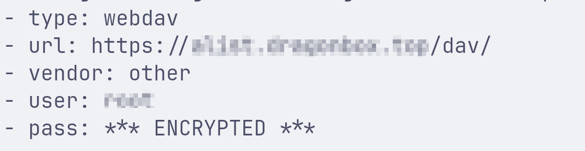
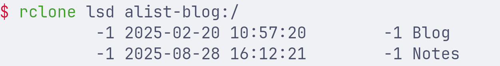

<!--more-->

因为现在将博客目录放在了我的小型服务器上，但是日常写博客还是在本地，因此需要使用远程挂载的方法让本地生成的博客可以直接上传到服务器上。

首先要知道的一点是，对于hugo博客而言，日常写博客都是在`contents/posts`这个目录下面，而在执行`hugo`命令生成博客时，生成的内容存储在`public`这个目录下，该目录也就是外部访问到的实际的博客内容。因此，我目前围绕博客搭建了以下docker容器：

- nginx容器：负责暴露public目录供外部访问
- alist容器：负责存储public目录并使其以webdav的形式可以被挂载到我写博客的机器上


```yaml
services:
  blog:
    image: nginx:latest
    ports:
      - 60001:80
    volumes:
      - ./alist/storage/Blog/public:/usr/share/nginx/html
    restart: unless-stopped
  alist:
    image: xhofe/alist:latest
    volumes:
      - ./alist/data:/opt/alist/data
      - ./alist/storage:/opt/alist/storage
    ports:
      - 60002:5244
    restart: unless-stopped
```


接下来在写博客的机器上，使用`rclone config`命令先配置一下，除了`vendor` 这项设置为other，其他的内容自己该填的填，不知道的就留空，最后会确认配置信息的，差不多是下面这样：




使用命令检查一下配置是否可用，这里用lsd查看一下远程目录



使用rclone mount来将远程的目标目录挂载到本地hugo下的public目录， `--vfs-cache-mode full` 能让 rclone 挂载的目录像本地磁盘一样用，兼容性最好，适合大部分需要写操作的场景。

```sh
rclone mount alist-blog:/Blog/public ./public --vfs-cache-mode full
```

执行该命令之后，另起一个终端，可以看到public目录下已经可以看到远程文件了。

最后，为了让该挂载过程自动化，新建一个systemd服务并设置开机自启。

```shell
sudo vi /etc/systemd/system/rclone-webdav.service
```

```
[Unit]
Description=Mount WebDAV directory using rclone
After=network-online.target
   
[Service]
User=ch4ser
Type=simple
ExecStart=/usr/bin/rclone mount alist-blog:/Blog/public /home/
ch4ser/Documents/Blog/public --vfs-cache-mode full
   
[Install]
WantedBy=multi-user.target
```

```shell
systemctl enable --now rclone-webdav.service
```

